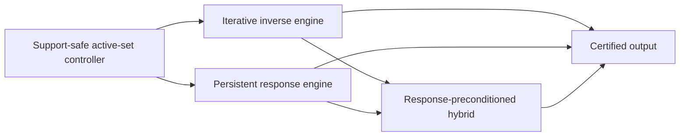

# Local Solver Family Roadmap

**Status:** Working research organization, not an accepted complexity theorem.

## Confidence statement

The project's current best risk-adjusted architecture combines persistent
response information with local iterative repair. This is a research judgment,
not a claim that every optimal local solver must be hybrid.

Two endpoints remain possible:

- a graph-uniform, output-sensitive incremental SDD/Schur solver could make the
  iterative layer unnecessary and improve the target all the way toward the
  explicit-output scale;
- a future expanding-subspace first-order method could attain the product scale
  without maintaining a nontrivial response representation.

The mixed architecture is valuable because it interpolates between these open
endpoints. It also gives a common place to reuse the project's proved support
gates, response identities, iterative convergence results, and counterexamples.

## Three independent axes

Do not identify the following choices.

| Axis | Alternatives | What it controls |
| --- | --- | --- |
| Graph access | Adjacency-list queries, supplied subgraph, global matrix access | Which graph information is available and charged. |
| Support evolution | Fixed, nested, or nonnested | Which principal systems occur and whether monotonicity or downdates are available. |
| Inverse realization | Iterative recurrence, persistent response, or a mixture | How the restricted inverse is represented and where condition-number dependence enters. |

In particular, a nested active set does not make an algorithm an SDD method.
ASPR, expanding-subspace FISTA, and restarted restricted CG use nested sets but
remain iterative unless they maintain an elimination, Schur, or comparable
graph-aware inverse representation.

## Common operator

The shared PageRank matrix is

\[
Q=\alpha I+\frac{1-\alpha}{2}\mathcal L,
\qquad
\alpha I\preceq Q\preceq I.
\]

For an active set \(S\), all solver families act on the same local Green
operator

\[
G_S:=Q_{SS}^{-1}.
\]

If \(S^+=S\cup T\), the new block is governed by

\[
K_T=Q_{TT}-Q_{TS}G_SQ_{ST}.
\]

The iterative family realizes \(G_S\) temporally through repeated row,
gradient, coordinate, splitting, or Krylov operations. The response family
realizes it spatially through elimination, factors, Schur complements, or
directed messages. A mixed method keeps a response for a settled anchor and
iterates on a smaller unresolved frontier.

## Backend-neutral controller

The active-set controller should depend on a small conceptual interface:

1. `Expand(T)`: incorporate a support-safe batch without materializing every
   old coordinate.
2. `BoundaryBounds()`: return certified intervals for boundary KKT demands or
   residues.
3. `Repair(tolerance)`: reduce numerical error on the current face.
4. `Finalize()`: materialize the terminal vector and its certificate once.

The interface is mathematical rather than an adopted implementation or
stopping-rule convention. Exact residual formulas remain note-scoped while
`docs/decisions/residual-convention.md` is open.

## Family map



The exhaustive per-note classification is machine-readable in
[`../manuscript/notes/taxonomy.toml`](../manuscript/notes/taxonomy.toml). Run

```bash
make note-report
```

to print its current Markdown table, or

```bash
make note-audit
```

to check it against the note manifest, note directories, build list, and
dependency graph.

## Complexity template

Let \(V\) denote the final charged active volume and let \(P_S\) be the
backend's current SPD preconditioner. Define

\[
\kappa_{\mathrm{eff}}(S)
=
\kappa\!\left(P_S^{-1/2}Q_{SS}P_S^{-1/2}\right).
\]

A useful conditional target is

\[
\widetilde O\!\left(
U_{\mathrm{response}}(V)
+V\sqrt{\sup_S\kappa_{\mathrm{eff}}(S)}
+V
\right),
\]

where \(U_{\mathrm{response}}\) includes all factor updates, adjacency
exposure, boundary reporting, rekeys, interval refinements, and state writes.
This expression is a proof template, not an established general theorem.

- With no graph-aware preconditioner, the spectral term is naturally
  \(\widetilde O(V/\sqrt\alpha)\).
- With a constant-quality response preconditioner but quadratic response
  maintenance, the repeated-prefix obstruction remains.
- With constant or polylogarithmic effective conditioning and
  \(U_{\mathrm{response}}(V)=\widetilde O(V)\), the target approaches
  \(\widetilde O(V)\).

### Frozen Round-022 acceptance target

The end-to-end graph-uniform target is now fixed for auditing. On a finite
simple undirected unweighted graph with no isolated vertices, adjacency-list
access, and a sparse nonnegative seed distribution `s`, define
`x^0=Q^(-1)b`, `pi=D^(1/2)x^0`, and
`pi_hat=D^(1/2)x_hat`. An accepted exact-real algorithm must return a sparse
`x_hat` satisfying

```text
max_i |pi_hat_i-pi_i|/d_i <= eps_ppr
```

with one complete terminal certificate and return, while charging the seed
input and every discovery, repeated row read, inner update, correction/rekey,
response operation if used, certificate query, materialization, state write,
and output write. The target is

```text
nnz(s) + O_tilde(1/(sqrt(alpha) eps_ppr)).
```

An RPPR route must state its regularization conversion, for example
`rho=tau=eps_ppr/2`, and terminal certificate. When `alpha` is bounded below
by a constant, monotone coordinate descent is an allowed fallback. Exact-real
means algebraic-cell arithmetic, not exact minimizer output or a floating-
point/bit guarantee. This paragraph is a target contract, not a theorem. No
current route meets it.

## Current note routing

### Iterative track

Use this track for methods whose strongest graph-dependent primitive is a
local recurrence or restricted first-order/Krylov solve:

- `aesp_cd_l1_rppr`;
- `aesp_locgd_star_lower_bound`;
- `aspr23_bound_audit`;
- `volume_gated_acceleration`;
- `evolving_support_cg`;
- `rlsor_terminal_exact_rung`;
- `frontier_adaptive_ladder`;
- `two_rung_sor`.

The phrase "exact rung" in the empirical SOR notes refers to unit coordinate
settlement. It is not by itself an exact restricted block solve.

### Response track

Use this track when persistent elimination or response state is the principal
algorithmic resource:

- `incremental_active_set_sdd`;
- the path, tree, bounded-block, shell, and quotient response solvers inside
  `delayed_reflection_ladder` and `propagate_settle_framework`.

For bounded biconnected blocks, ordinary adjacency access is now sufficient:
zero-prefix invariance at activation events permits online block mergers and
future-only response rebuilds.  Stable block identifiers are no longer an
assumption for the product-scale theorem.

### Mixed track

Use this track when propagation or acceleration and response settlement are
both essential:

- `adaptive_revisit_control`;
- `hybrid_aesp_locsor` after its three-arm, branch-seeded double-Y, and
  strict-range canonical branch-caterpillar common-state response handoffs;
- `two_rung_direct_theory` after its Schur-deflation extension;
- `delayed_reflection_ladder`;
- `propagate_settle_framework`;
- `response_preconditioned_hybrid`.

The common-state switching interface is exact through the first genuine
branch, and the underlying response interface now reaches one fixed
two-branch core. For `0 < alpha < 1` and `0 < rho < 1/3` in exact real-cell
arithmetic, a center-seeded three-arm spider has a `kappa = 1`
activation-token countdown for every legal certified batch order, using one
affine transfer product per actual arm prefix and two root scalars. Its full
exposure, response, control, state, recovery, and output ledger is
`O(C(S*)) = O(1 / rho)`. A fully charged gate-compatible Phase-I prefix can
discard its signed numerical state, reconstruct those actual common arm
prefixes in one pass, and continue with this response without private replay.
The resulting total is `B_J^full + O(C(S*))`; product work follows only from an
independent bound on `B_J^full`.

On the double-Y seeded at branch vertex `o`, `s=e_o`, four pendant-prefix
products couple through one scalar before the adjacent branch is admitted and
through a fixed-size SPD `2 x 2` Schur core afterward. For `0<alpha<1` and
`0<rho<1/3`, the same exact-real activation-token tightness `kappa=1` and fully
charged `O(C(S*))` work hold for every legal batch order. With
`zeta=(1-alpha)/(1+alpha)` and
`rho_link(alpha):=zeta/[3(3+zeta)]`, `rho<rho_link(alpha)` forces entry into
the rank-two phase. Every fully charged gate-compatible Phase-I prefix now has
a paid common-state conversion to this response, with no private replay. The
prefix and post-handoff theorems report all eleven coordinates; the latter
includes constant-size external certificate emissions at every declared
interaction stage. The total is `B_J^full + O(C(S*))`, so product work still
requires an independent bound on `B_J^full`. No estimate-sequence energy is
transported, and no other-seed, graph-uniform, or finite-precision theorem
follows.

The first growing branch-core test separates one failed representation from
the still-live implicit route. For each fixed `m`, branch seed `s=e_(b_1)`,
`0<alpha<1`, and family-dependent
`0<rho<rho_cat(m,alpha)<=1/3`, one legal exact-KKT positive-subset singleton
order reaches an `m`-vertex tridiagonal branch core and then appends a
length-`m` endpoint arm while `m+1` positive leaf tips are deferred. Every arm
append changes every deferred exact tip demand. The literal exact-cell
`EagerTipKey` state, which keeps separately addressed values and forbids lazy
indirection, therefore performs at least `m(m+1)` old-key writes. This is not
the canonical all-violations order, no `m`-uniform positive `rho` range is
claimed, and it is not a lower bound for implicit, lazy, sign-persistent, or
kinetic/group reporters or finite-precision implementations. A balanced
affine-transfer tree still gives a named attachment-cell update, branch
append, or tip query in `O(log(2+m))` exact work and `O(m)` retained cells.
For the explicit backbone-first policy, the exact
`CaterpillarKineticDelta` state now upgrades those point queries to an
all-positive delta reporter: every strict tip crossing is keyed in one
monotone scalar, emitted once, and charged through a heap, for total
`O(m log(2+m))` work and `O(m)` retained cells. This remains a fixed-`m`,
branch-seeded, family-dependent-`rho`, exact-real result. It does not cover the
pre-backbone phase, repeated full-list output, a uniform positive `rho` range,
finite precision, or a graph-uniform reporter.

The actual canonical policy is now closed on the smaller strict range
`0<rho<rho_can(m,alpha)<=rho_cat(m,alpha)`. Its exact all-violations trace has
exactly `m` three-label distance-layer batches. The exact-real
`CaterpillarCanonicalLayerDelta` reporter charges localized absorption and
transfer-cell updates, balanced parent-coordinate queries, every demand test
and delta/certificate exchange, recovery, validation, materialization, and
terminal output in `O(m log(2+m))` work and `O(m)` state. This is still a
fixed-`m`, branch-seeded, delta-only result; it proves neither `kappa=1` nor
PPR conversion, and it claims no positive `rho` range uniform in `m`.

On that same strict canonical range, any fully charged Phase-I prefix ending
at an actual checkpoint now has a paid support-only hybrid handoff. One direct
pass constructs the current arm/leaf absorptions, tridiagonal branch cells,
and balanced transfer state, then invokes `CaterpillarCanonicalLayerDelta`
without replaying or querying any prior face. The exact-real total is
`B_J^full + O(C(S*) log(2+C(S*)))`, with all eleven prefix and suffix resource
coordinates explicit. Product work still requires an independent fully
charged bound on `B_J^full`; no estimate-sequence energy is retained. The
uncapped instruction “run any finite valid burn-in” cannot provide that bound:
arbitrarily many valid exact-inner Catalyst stages may leave the common
checkpoint at `Uhat_0={b_1}` while adding `Omega(N)` control work.

The named `Full-BC-AESP_0` policy provides one positive comparator for the
promised fixed family only. For `m>=2`, `alpha<1/2`, and `rho<rho_can`, it pays
a complete traversal, certifies the full envelope `U=V=S*`, runs exactly
`T_*=ceil(2 log(4)/sqrt(alpha/(1-alpha)))` relative-accuracy AESP-CD stages,
and invokes no gate before handing off at `k=0`. Its full prefix vector is
`(O(D_*),O(D_*),0,O(C_*),O(H_*),O(D_*),0,O(C_*),O(C_*),O(D_*),0)` and its
authoritative work is `O(H_*)`; composing the separately charged response
costs `O(H_*+C_* log(2+C_*))` and returns the exact RPPR optimum. The soft
product shorthand hides `log(1/(1-2 alpha))` and is not uniform as `alpha`
approaches `1/2`. The policy exposes all realized support before acceleration,
discards its proved half-gap at handoff, and is not adaptive locality, a
general prefix theorem, graph-uniform work, finite precision, or PPR
conversion. The next mixed-track steps are a capped automatically exploring
accelerated Phase I, the remaining canonical range
`rho_can<=rho<rho_cat`, other seeds or policies, arbitrary pre-backbone
interleavings, and the separately charged full-list interface.

The response-native `FirstLayer-BC_1` policy now closes one local actual
nonzero-checkpoint comparator on that same fixed family and strict range. It
scans exactly `Uhat_1={b_1,b_2,a_1,r_1}`, commits the first canonical batch,
settles that face exactly, and retains its native response state. Admitted
support, exact numerical support, and scanned rows coincide; only the next
layer's labels are known without row exposure or admission. Its prefix vector
is `(9,2,1,0,O(1),0,O(1),O(1),O(1),Theta(1),Theta(1))`, and the post vector
`eq:branch-caterpillar-first-layer-post-eleven-vector` charges the remaining
`m-1` batches and terminal return. In-place continuation has the authoritative
exact-real bound `O(C(S*) log(2+C(S*)))`. This is response-native RPPR
settlement and claims no accelerated locality.

The sharp signed-gate calculation explains the remaining accelerated gap. At
checkpoint `k`, a boundary demand changes by
`beta_(k,v)(z_parent-x_parent)`, so a symmetric certificate needs radius below
`mu_k=min_v g_(k,v)/beta_(k,v)`. Zero initial objective gap is exact and runs
zero stages. For positive gap, the imported relative-gap route gives only the
sufficient cap
`T>(2/sqrt(alpha/(1-alpha))) log_+(4 Delta_(k,0)/(alpha mu_k^2))`, and each
relative-oracle stage retains the explicit `log(1/(1-2 alpha))` term. The old
constant half-gap does not imply this comparison. A capped accelerated local
splice must therefore pay the margin interface or prove a stronger charged
one-sided certificate; this proposition is not a lower bound against exact
settlement.

The exceptional first-layer margin is now closed, but only as a comparison
witness. At the actual checkpoint `Uhat_1`, one paid scan of the three live
rows has volume `nu_1=6` for `m>2` and `nu_1=3` for `m=2`; together with the
retained four-coordinate exact response it computes the sharp `mu_1` on
demand with incremental vector
`(nu_1,1,0,0,O(1),0,O(1),O(1),O(1),O(1),0)`. The named
`MarginCert-BC-AESP_1` policy then runs zero stages at zero gap or the exact
positive-gap cap
`T_1=1+floor((2/sqrt(alpha/(1-alpha)))`
`log_+(4 Delta_(1,0)/(alpha mu_1^2)))` on the fixed signed face `Uhat_1`.
With `A_1=T_1*9*L_1^rel`, `C_1=13`, `C_2=16+nu_1`,
`D_1=C_2+A_1`, and `H_1=C_2+(1+log(2+C_1))A_1`, its complete prefix vector is
`(9+nu_1+O(A_1),3+O(A_1),1,0,O(H_1),O(A_1),O(1),O(C_2),O(C_1),`
`O(D_1),Theta(1))`; its direct suffix vector is
`(vol(S*\Uhat_2),m-2,m,0,O(C(S*)),0,O(C(S*)+(m-1)log(2+m)),`
`Theta(C(S*)),O(C(S*)),Theta(|S*|),|S*\Uhat_1|+|S*|+Theta(m))`.
The total is `O(H_1+C(S*) log(2+C(S*)))`. The signed endpoint genuinely
supplies the next gate state, but the exact response that certified `mu_1`
could decide the same gate and is separately charged. This is therefore no
speedup or automatic locality result. The mixed-track priority is now a
scalable on-demand certificate at `k>=2` that does not use an exact response
comparator, followed by a capped automatically exploring signed prefix; both
the margin logarithm and `log(1/(1-2 alpha))` remain live costs.

Round 015 removes the response from the first-layer sign certificate, but not
from the eventual solver. The principal-face Stieltjes lower retraction
`L_U(z)=[z-Delta_U^low(z)D_U^(1/2)1]_+` satisfies `0<=L_U(z)<=x_k`, so a
strict positive boundary demand at the lower point certifies the exact sign.
At `k=1`, the same paid live-row scan now has incremental vector
`(nu_1,1,0,0,O(1),0,0,O(1),O(1),O(1),0)`, with `C_resp=0` exactly. The
two-gate `LowerGate-BC-AESP_(0:1)` policy commits the first batch without
settlement and has pre-second-interaction prefix vector
`(9+nu_1+O(A_<2^low),3+O(A_<2^low),1,0,O(H_<2^low),`
`O(A_<2^low),0,O(C_2),O(C_1),O(D_<2^low),Theta(1))`.
Only this prefix is response-free. Its direct suffix builds and charges the
native response on `Uhat_2`, with vector
`(vol(S*\Uhat_2),m-2,m,0,O(C(S*)),0,O(C(S*)+(m-1)log(2+m)),`
`Theta(C(S*)),O(C(S*)),Theta(|S*|),|S*\Uhat_1|+|S*|+Theta(m))`.
Charged validation also forces the degree-six candidate rows
`b_2,a_1,r_1` to be exposed before the first reply. That is a scoped access
STOP, not an information-theoretic lower bound or a claim against free trusted
template metadata. The named zero resets discard cross-face progress, the
analysis-side stage bound still uses `mu_0,mu_1`, and no speedup follows. The
mixed-track priority is therefore a `k>=2` lower-point diagnostic that avoids
full old-face scans, candidate-row pre-exposure, and zero resets before a
capped automatically exploring prefix is attempted.

Round 016 closes the all-layer correctness and whole-vector-reset parts of
that priority, but not its efficiency or accelerated-state parts. Principal
Stieltjes face monotonicity makes zero padding preserve any charged lower
point, and the anchored map `a vee L_U(z)` never decreases its old lower
coordinates. For every fixed `2<=q<=m`,
`TransportLower-BC-AESP_(0:q-1)` commits `q-1` canonical batches while
preserving a nonzero lower anchor and remains response-free only before
interaction `q`. Its exact prefix vector is
`(V_q^can+O(A_<q^tr),q+1+O(A_<q^tr),q-1,0,O(H_<q^tr),`
`O(A_<q^tr),0,O(C_q^can),O(C_(q-1)^can),O(D_<q^tr),Theta(q))`.
The direct suffix then builds and settles the native response on `Uhat_q` and
has vector
`(vol(S*\Uhat_q),m-q,m-q+2,0,O(C(S*)),0,`
`O(C(S*)+(m-q+1)log(2+m)),Theta(C(S*)),O(C(S*)),Theta(|S*|),`
`|S*\Uhat_(q-1)|+|S*|+Theta(m-q+2))`; total work is
`O(H_<q^tr+C(S*)log(2+C(S*)))`. Every AESP momentum, proximal, center, and
estimate-sequence record is restarted, every live candidate row is
pre-exposed, and every sign test pays a full growing-face sweep. The current
mixed-track priority is therefore a sublinear charged diagnostic or matching
repeated-prefix obstruction plus an explicit admission-shock law that
transports or amortizes useful accelerated state. The all-layer theorem is a
comparison, not a speedup, automatically exploring prefix, graph-uniform
bound, finite-precision result, or PPR conversion.

Round 017 closes the repeated query-time sweep part of that priority, but not
the phase-transition cost. `ImplicitLowerHeap` stores the raw lower residual
and an indexed maximum of its normalized negative part. A coordinate write
rekeys only the written coordinate and its in-face neighbors from the already
paid stencil; a complete caterpillar gate query reads that maximum and three
cached boundary-parent coordinates in constant work, without scanning or
materializing the old lower vector. For every fixed `2<=q<=m`,
`ImplicitLowerHeap-BC-AESP_(0:q-1)` therefore preserves exactly the Round-016
anchor and has response-free prefix vector
`(V_q^can+O(S_<q^row+A_<q^ih),2q+1+O(A_<q^ih),q-1,0,`
`O(H_<q^ih),O(D_<q^ih),0,O(C_q^can),O(C_(q-1)^can),`
`O(D_<q^ih),Theta(q))`. Its direct suffix still builds and pays the native
response on `Uhat_q`. Crucially, the prefix charges
`S_<q^row=3q^2` for one raw-product/heap initialization per face and
`S_<q^adm=(q-1)(3q+2)/2` for transported-anchor writes, restarts every AESP
auxiliary, pre-exposes candidates, and retains the margin-dependent analysis.
For `q=m` those admission/restart shocks remain quadratic. The next
mixed-track target is therefore to transport or amortize useful accelerated
state across admissions, or prove an exact obstruction; the incremental heap
is a diagnostic GO, not a speedup or energy-transport theorem, and the named
`LiteralDenseLowerSweep` comparison is not a class lower bound.

Round 018's `thm:branch-caterpillar-incremental-face-handoff` removes the
raw-product rebuild and eager-anchor-copy portions of
that transition cost, but not the accelerated restart. `FaceCarryLowerHeap`
zero-pads a successful signed endpoint: every old raw lower residual and heap
key remains exact, and the three pre-exposed candidate rows generate exactly
three new keys. Heap-maximum range-minimum tags plus flush-before-write markers
represent every old lower-anchor coordinate without an admission-time old-face
visit. For fixed `2<=q<=m`, `FaceCarryLowerHeap-BC-AESP_(0:q)` commits all
`q` canonical batches and has prefix vector
`(V_q^can+O(A_<q^fc),q+1+O(A_<q^fc),q,0,O(H_<q^fc),`
`O(A_<q^fc + Q_<q^fc + q),0,O(C_q^can),O(C_(q-1)^can),`
`O(D_<q^fc),3q+Theta(q))`. Its paid native-response suffix is
`(vol(S*\Uhat_q),m-q,m-q+1,0,O(C(S*)),0,`
`O(C(S*)+(m-q)log(2+m)),Theta(C(S*)),O(C(S*)),Theta(|S*|),`
`|S*\Uhat_q|+|S*|+Theta(m-q+1))`. The interaction coordinate is exactly
`R_int=m+1`; the adjacency coordinate is instead
`R_adj=m+1+O(A_<q^fc)`, because charged numerical row touches and missing bulk
endpoint products cannot be discarded. Candidates remain pre-exposed, and
the named `DenseFreshAESP` representation still writes `q(3q-1)/2` fresh
momentum/proximal/center/estimate-sequence coordinate records, which is
quadratic at `q=m`. The next mixed-track target is a lazy, transported, or
amortized accelerated auxiliary representation—or an exact obstruction—while
retaining all endpoint products and analysis margins. This result is no
speedup, energy-transport, scalar-potential, graph-uniform, finite-precision,
or PPR theorem.

Round 019 shows that the named dense restart is not intrinsic at one specially
settled zero-momentum checkpoint, while exposing the first exact semantic
obstruction. The center, momentum, and estimate-point arrays zero-pad; the
proximal array retains every old entry and appends exactly three positive
`g_(k,v)/L_A` cells. `SettledAuxAppend` therefore writes twelve new coordinate
records across the four explicit arrays plus one reset marker, with transition
vector
`(0,0,0,0,O(1),O(1),0,Theta(C_(k+1)^can),O(1),12+Theta(1),0)`
and no old-coordinate rewrite, row/product/query, adjacency, or response
operation. The old zero analytical estimate certificate nevertheless acquires
the mandatory shock
`Sigma_k^es>=(mu_E/2)sum_(v in F_k)(x_(k+1))_v^2>0`; it must be restarted or
explicitly bounded and charged. The response-assisted
`FirstAuxShock-BC-AESP_(1->2)` audit has prefix vector
`(9+nu_1,3,2,0,O(1),O(1),O(1),O(C_2),O(C_2),Theta(C_2),6+Theta(2))`
and the directly paid post vector
`(vol(S*\Uhat_2),m-2,m-1,0,O(C(S*)),0,`
`O(C(S*)+(m-2)log(2+m)),Theta(C(S*)),O(C(S*)),Theta(|S*|),`
`|S*\Uhat_2|+|S*|+Theta(m-1))`; both interaction and first-exposure totals
are exactly `m+1`. It runs no accelerated stage after the append and hence
proves no speedup or amortization for actual nonsettled momentum states. The
mixed-track priority is now to bound and pack that analytical shock along the
actual `FaceCarryLowerHeap` endpoints, or prove their first obstruction,
without candidate-row overexposure or hidden margin/product work. The
remaining canonical range, other seeds/policies, graph-uniform work, PPR
conversion, and finite precision remain separate.

Round 020 crosses the semantic boundary identified by the settled audit. For
`rho<min(rho_can(m,alpha),1/30)`, one shifted AESP stage on `Uhat_0` ends at
a strictly nonsettled point whose exact margins certify `F_0`. The primal,
nonzero momentum, extrapolated center, and estimate point zero-pad across the
admission, while the proximal warm start retains its old cell and appends
three positive cells. `NonsettledShockRegister` charges two stored-row
products, twelve appended array cells, and the observable KKT budget `B_ns`,
which bounds the positive enlarged-face estimate certificate without an
optimum query. One relative-accuracy AESP-CD stage then runs on `Uhat_1`
before the paid native suffix. All live candidate rows, endpoint products,
margin conditions, state writes, and oracle logarithms remain in the exact
transition, prefix, and post vectors. This is a genuine one-admission/one-
continuation GO, but its fresh reset provides no shock amortization or
speedup.

Round 021 reaches a second actual nonsettled admission only in the sharper
range `rho<min(rho_can(m,alpha),rho_2(m,alpha))`, with
`rho_2=(1+beta_A)/(138+3beta_A)` for `m=2` and
`rho_2=(1+beta_A)/(354+3beta_A)` for `m>2`. The extrapolated lower center
`y+` does not certify `F_1`; its proximal warm start `u_1(y+)` does. Locking
the imported oracle to greedy normalized-KKT AESP-CD gives
`u_1(y+)<=z_1<=p_1(y+)<x_1`, so the actual oracle output preserves the three
strict batch signs. After committing `F_1`, a second two-product, twelve-cell
register computes fresh `B_2`, followed by one genuine stage on `Uhat_2` and
the native response suffix. The complete ledgers have total
`R_int=m+1`, structural first exposure exactly `m+1`, and full
`R_adj=m+1+O(A_2NS)`. No inequality relates `B_2` to `B_ns`; the result is a
two-admission/two-continuation GO and an accelerated-rate STOP. The next
mixed-track target is a multi-face shock relation or a scoped obstruction,
with the greedy restriction, sharper margin, four transition products, both
oracle logarithms, candidate exposure, and every fixed-family/exact-real
qualification retained.

Round 022 stops the simplest additive reset repair without giving a work
lower bound. On the exact settled endpoint path `P_3`, with
`q_r^2=alpha/(1-alpha)`, the declared observable reset and exact admission drop
satisfy `B_1/Delta_1=3/(4q_r^2)+O(1)`. Thus neither an alpha-uniform nor an
`O(1/q_r)` additive coefficient works for this budget. The surviving general
settled coefficient has sharp order `Theta(1/alpha)`, and the separate
conditional nested telescope costs `Theta(alpha^-2)` under assumptions not
proved for the actual nonsettled greedy trace. The analytical settled shock
itself remains below `2Delta`, and the relative stage oracle sees `B_1` only
inside a logarithm. Separately, literal use of the conservative no-sharing
two-product reset register at all `m` canonical caterpillar admissions reads
exactly `6m^2+12m-6` stored-row cells. Sharing or another representation may
avoid this named-interface cost, so it is not necessary work or a class lower
bound. Route A's next target is a nonadditive or logarithmic reset ledger on
the actual Round-021 trajectory, with every candidate exposure and product
charged.

### Model and synthesis track

Use this track for scope control, lower-bound models, and cross-note ledgers:

- `local_solver_oracle_hierarchy`;
- `hybrid_local_solver_complete_note`;
- `hybrid_local_solver_synthesis`.

## Priority proof obligations

### P0: finite-band response on general cyclic cores

Maintain enough of the boundary response to decide all demands outside a
prescribed normalized KKT band. Charge every old-face read, factor update,
rekey, ambiguity refinement, and reported activation. Exact zero-sign
maintenance is not required for approximate output.

This is the weakest known response theorem that plugs into the proved
finite-resolution continuation result in `propagate_settle_framework`.
The causal block-merge theorem closes this obligation for bounded blocks; the
P0 case is therefore a large nonequitable cyclic core, not block metadata
maintenance.

The finite-band interface is now margin-adaptive. Certified lower endpoints
drive safe admission, certified upper endpoints drive termination, and no
uniform pointwise estimate or coordinate-specific response leverage is
required. Exterior response changes are energy contractions, so degree volume
moving by a normalized margin is shock-packed. Source-aware squared leverage
is exactly terminal Schur-diagonal loss and telescopes to at most
`(1-alpha)/2` per still-exterior label. Chebyshev inverse-square-root probes
construct a complete one-sided boundary-loss checkpoint in
`O_tilde(cvol(S)/sqrt(alpha))` work, and geometric checkpoints sum to the same
final-volume product scale. Between checkpoints, Chebyshev whitening accepts
any constant-factor spectral frontier, replaces exact inverse-square-root
source solves, and costs `O_tilde(T_mv/sqrt(alpha))`. A positive geometric
resolvent ladder gives a second construction: its shifted work mass and
monotone Schur-coordinate settlement ledger are `O(1/sqrt(alpha))`, every
rung is a sparse shifted face system, and every unfinished solve is exact
nonnegative anchor debt. On one exact-real fixed `(A,F)` partition, exposed
cut, and ladder, aggregation plus signed Chebyshev semi-iteration now realizes
all that debt: the scalar recurrence costs
`O_tilde(cvol(T)/sqrt(alpha)+C_frag)`, `r` source columns are charged as the
sum of their runs, and signed sources use `2r` nonnegative streams. The energy
certificate gives mathematical exterior intervals only. The named
non-output-sensitive `AllBoundaryFlush` pays the cut scan, interval
computation/classification, materialization, validation, memory, rounds, and
emission in its full eleven-vector. The remaining P0 primitive is therefore
an output-sensitive partial flush or equivalent target-side sparse-recovery
interface between checkpoints, without refreshing the full boundary.
The first fixed-face stress test rules out only one literal representation of
that primitive. On the frozen notched-double-sun face containing all anchors
and source petals, with fixed `n` and sufficiently near-one `alpha`, unit
first-rung fragments create exactly one new report crossing per event at gate
`g=((1-alpha)/2)^(5/2)` and band `g/2`, while every exact response increment is
dense. The named separately addressed `EagerExactSlack` state must therefore
read and overwrite `Theta(p n^2)` exact cells and pay the same response,
control, and materialization scale for only `Theta(r n)` delta/certificate
output; `p=r` for nonnegative columns and `p=2r` for signed certification. The
complete charge is `eq:notched-sun-eager-eleven-vector`. This is a fixed-face
exact-real debt/query obstruction, not an RPPR chronology or a lower bound on
implicit cyclic transfer, packed coded queries, scale-truncated state,
on-demand validation, or any general partial reporter.
The same frozen trace now has a narrow positive comparator. For `n>=5`,
`eta in (0,1/8)`, and `vartheta=(1-alpha)/2<=1/(1296n^2)`, when the face, cut,
ladder, unit event order, and amplitudes are all verified, an
entrywise-nonnegative Neumann expansion
puts the matching response above `vartheta^(5/2)` and the cumulative future
tail below half that gate. `NotchedSunScaleDelta` therefore stores only the
template/label map, ladder, counter, and stream metadata and emits one delta
plus one universal future-safe certificate per logical column without a
response application, future-label scan, or response/slack cell. Its complete
vector is `(Theta(n),2,n,Theta(n+J+p),Theta(C_frag+rn+n),0,0,`
`Theta(n+J+p),O(1),0,Theta(rn))`, with `p=r,C_frag=rn` for nonnegative columns
and `p=2r,C_frag=2rn` for separately checked signed streams. This is
exact-real, fixed-template, fixed-order, and scale-aware; it is neither RPPR
chronology nor a generic dynamic reporter, terminal solver, fixed-`alpha`
uniform theorem, or finite-precision result. Consequently P0 is no longer
allowed to infer a broad lower bound from `EagerExactSlack`; it must handle
arbitrary legal fragments/orders, capacity and slack refresh, and transition
bands without repeated cut scans or stored-response reads.
Round 015 removes the prescribed order axis only. Because the matching and
off-matching bounds are pointwise, `NotchedSunPermutationDelta` verifies one
common previously unseen petal across all streams using a seen-label set and
supports every common permutation. Its vector, including `p=r` versus `2r`
and `C_frag=rn` versus `2rn`, is unchanged. The GO still fixes the template,
face, cut, pairing, complete ladder, unit amplitudes, near-one scale, and
exact-real model. P0 must now handle repeats, missing petals, per-column
schedules, batches, arbitrary fragments/amplitudes, template changes, and the
already open capacity/slack/transition-band costs; the permutation result is
not RPPR chronology or a generic partial flush.
Round 016 removes bounded declared repetition from that list, still for fixed
`n>=5` and `eta in (0,1/8)`. For positive exact multiplicities `mu_i`, let
`L=sum_i mu_i` and
`H=L-min_i mu_i`; the exact scalar-envelope condition is
`18H sqrt(vartheta)+3vartheta<=1`, equivalently
`vartheta<=(sqrt(81H^2+3)+9H)^(-2)`. Under the same fixed template, face,
cut, pairing, ladder, unit amplitudes, exact-real model, and one common
cross-stream multiset schedule, `NotchedSunMultiplicityDelta` uses one
exact-cell counter per label. First occurrences emit deltas, repeats emit no
delta, and every accepted event emits a future-safe certificate per logical
column. Its vector is
`(Theta(n),2,L,Theta(n+J+p),Theta(C_frag+rL+n),0,0,`
`Theta(n+J+p),O(1),0,Theta(rL))`, with `p=r,C_frag=rL` or
`p=2r,C_frag=2rL`; it performs no response application, future-label scan,
slack update, or numerical materialization. P0 must now handle unbounded or
undeclared repetitions, omitted labels, different per-column schedules,
batches, arbitrary fragments/amplitudes, template mutation, and the already
open capacity/slack/transition-band costs. The displayed root is sharp only
for the uniform scalar Neumann envelope. This multiplicity result is not
RPPR chronology, a generic dynamic partial flush, a fixed-`alpha` uniform
theorem as `L` grows, terminal solving, or finite-precision/word/bit work.
Round 017 removes the unit-logical-amplitude promise, but only for one declared
finite positive schedule shared by all logical columns and streams, still for
fixed `n>=5` and `eta in (0,1/8)`. For label `i`, let `k_i*` be the first
declared prefix mass above
`kappa_i=d_(u_i)(1+c_eta)sqrt(vartheta)`, define
`gamma_i=kappa_i-A_(i,k_i*-1)` and the tight full-interleaving horizon
`F_i=A-A_i+A_(i,k_i*-1)`, and require
`m_A=min_i(lambda_i gamma_i-epsilon F_i)>0`. Then
`NotchedSunAmplitudeDelta` keeps every unseen or seen-but-unreported label at
most `g-m_A` and reports label `i` exactly at its first strict crossing,
occurrence `k_i*`, for every allowed common interleaving. Its vector is
`(Theta(n),2,L,Theta(n+J+p+L),Theta(C_frag+rL+L+n),0,0,`
`Theta(n+J+p+L),O(1),0,Theta(rL))`; nonnegative streams have
`p=r,C_frag=rL` and absolute mass `rA`, while signed `2-minus-1` streams have
`p=2r,C_frag=2rL` and absolute mass `3rA`. There is no response/slack state,
future-label scan, or numerical materialization. Every fixed finite positive
schedule passes at a sufficiently near-one scale, but failure of this margin
rejects only the displayed scalar certificate. P0 must still handle
undeclared/unbounded mass, arbitrary signed logical amplitudes, omitted
labels, per-column schedules, batches, arbitrary fragment supports, template
mutation, dynamic capacity/slack refresh, RPPR chronology, and finite
precision. The result remains fixed-template, fixed-`n`, common-schedule,
complete-coverage, schedule-band, and exact-real only.

Round 018's `thm:notched-sun-columnwise-amplitude-delta-reporter` removes
exactly that common logical-column schedule. Each column
declares independent finite positive label/amplitude schedules, and
`NotchedSunColumnAmplitudeDelta` accepts an arbitrary one-column-at-a-time
asynchronous global interleaving. Cell `(q,i)` has a column-specific crossing,
pre-crossing gap, local mass horizon
`F_(q,i)=A_q-A_(q,i)+A_(q,i,k*_(q,i)-1)`, and positive margin `m_q`.
Other-column events enlarge only the global latency horizon because they leave
response column `q` unchanged. Only the affected column is recertified per
event, and all `rn` cells are emitted at their first exact crossings. With
`L_Sigma=sum_q L_q>=rn`, the vector is
`(Theta(n),2,L_Sigma,Theta(n+J+p+L_Sigma),Theta(C_frag+L_Sigma),0,0,`
`Theta(n+J+p+L_Sigma),O(1),0,Theta(L_Sigma))`. Nonnegative mode has
`p=r,C_frag=L_Sigma` and absolute mass `A_Sigma`; signed `2-minus-1` mode has
`p=2r,C_frag=2L_Sigma` and mass `3A_Sigma`, with the two physical records checked
atomically within their logical column. No response/slack/materialization or
other-column recertification is credited. P0 must now handle undeclared or
unbounded mass, arbitrary signed logical amplitudes, omitted labels, signed
pairs split across interactions, simultaneous batches, arbitrary fragment
supports, template mutation, dynamic capacity/slack refresh, RPPR chronology,
and finite precision. The result remains fixed-template, fixed-`n`, declared
positive, complete-coverage, per-column-schedule-band, and exact-real only; a
failed `m_q` rejects only this scalar certificate.

Round 019 removes exactly the one-event interaction restriction on that same
verified template. A nonempty atomic batch may mix labels and columns and may
contain several consecutive occurrences of one cell, but every touched cell
must supply a gap-free block of its next tagged declared occurrences.
`NotchedSunBatchAmplitudeDelta` stages and validates the complete batch before
mutation, then reports exactly the cells whose declared crossing indices lie
between the old and new endpoint counts and emits one certificate per affected
column. It defines no internal order or subevent crossing. For accepted-batch
count `B`, affected-column total `S_Sigma`, logical total `L_Sigma`, and peak
size `b_max`, `B<=S_Sigma<=L_Sigma`, `b_max<=L_Sigma`, and the vector is
`(Theta(n),2,B,Theta(n+J+p+L_Sigma),Theta(C_frag+L_Sigma),0,0,`
`Theta(n+J+p+L_Sigma),O(b_max),0,Theta(S_Sigma+rn))`.
Nonnegative mode has `(p,C_frag,mass)=(r,L_Sigma,A_Sigma)`; same-record
atomically paired signed mode has `(2r,2L_Sigma,3A_Sigma)`. Invalid attempts
pay their own interaction, staging, validation, scratch, and rejection output
without a persistent write. P0 must now handle undeclared/unbounded mass,
arbitrary signed logical amplitudes, omitted labels, signed pairs split across
records, coupled response, arbitrary fragment supports, template/ladder
mutation, dynamic capacity/slack refresh, RPPR chronology, and finite
precision. The result remains fixed-template, fixed-`n`, complete-declaration,
positive-mass, per-column-band, exactly separated, batch-boundary-only, and
exact-real; it gives no generic dynamic partial flush or hidden chronology.

On the prescribed notched-double-sun structural trace, exact diagonal-loss
updates have linear fixed-decoder dimension for each fixed size when `alpha`
is sufficiently close to one. This stops only the universal exact linear-tag
shortcut; scale-truncated, nonlinear, coded, and cyclic-transfer reporters
remain live. One fixed-event signed hash-and-bit bank now locates every
potentially ambiguous row with output-sized target dimension and candidate
count, but its harmonic construction, adaptive refresh, workspace, and exact
validation are not yet dynamically charged. Conversely, at threshold
`((1-alpha)/2)^5`, the same notched-sun trace reduces to one hierarchy path
only for fixed size and `alpha` above a size-dependent near-one threshold;
this is not a uniform fixed-`alpha` theorem.

That structural trace is now known not to be a canonical single-seed RPPR
`F`-only chronology. At every relevant common face, each unseeded matched
frontier/report pair `f_i,w_i` has identical exact demand and the canonical
all-violations gate co-admits it; one seed distinguishes at most one pair. The
finite-band consequence applies only to one simultaneous uniform
point-estimate call at that face, not to arbitrary asynchronous interval
refinement. The rank and representation audits remain valid, but no reporter
lower bound follows from this graph. A replacement P0 witness must first break
the symmetry and prove its canonical KKT admission trace before reporter
analysis.

The minimal degree-lift repair also fails that legality test. Pairing the
degree-two reports makes the raw anchor--report cut full rank while leaving
degree-one source petals and degree-four anchors. For every `0<alpha<1` and
`rho>0`, with `vartheta=(1-alpha)/2`, report quietness bounds every anchor by
`4 alpha rho / vartheta`, a positive petal demand requires more than
`2 alpha rho / vartheta`, and the nonseed anchor equation contradicts that
band. Consequently every canonical prefix that remains report-free contains
at most one source petal. This is a KKT-legality obstruction despite the
rank-`n` raw cut, not a reporter lower bound or a one-Green-direction
collapse. The next attempted repair replaced each direct report spoke by an
active relay with an unadmitted endpoint.

That two-edge active-relay repair is now also stopped. At every `W`-free
canonical face, the canonical all-violations batch containing a nonseed relay
also contains its degree-one petal unless that petal is already active. Thus a
common face with all relays already has at least all but one petal and cannot
be followed by a linear petal-only epoch, despite full-rank raw anchor--relay
and relay--report cuts. This remains only a KKT chronology obstruction: paired
petal--relay batches are possible, arbitrary positive-subset policies are not
covered, and no reporter lower bound follows. This motivated two tests:
raising the exterior petal degree to three with a petal cycle, and feeding
relays from an independent active backbone. Both are now resolved below, and
neither supplies a legal long report-free trace on its intended seed orbit.

The degree-three petal-cycle option is now retired too. Its isolated
relay-before-petal window is real, but global anchor balance exhausts that
window. For every `0<alpha<1`, `rho>0`, and seed orbit, if a `W`-free
canonical face contains all relays and its next all-violations batch is also
`W`-free, then at most one petal is still inactive. If a report enters with or
before the last relay, or in the first post-last-relay batch, the intended
report-free epoch has already failed. This is canonical all-violations KKT
chronology only: arbitrary positive-subset policies, reporter work, response
rank, scan/output lower bounds, stability, and finite precision remain open.
Feeding relays from an independent active backbone is now stopped for the
intended backbone-seed orbit as well. On the even double-cycle feed, every
report-free canonical prefix from a backbone seed is petal-free: report
quietness caps the maximum active anchor at its petal threshold, while every
newly positive anchor has its relay already active or co-admits it in the same
all-violations batch. Hence the first petal batch contains a report. The seed
scope is essential: for an anchor seed, `0<rho<(1-alpha)/8` gives an exact
report-free first-petal batch, but its exact continuation also stops. For every
even `n>=6` in that counterrange, at most the seed petal and its two neighboring
petals enter before the first report; the first `j+/-2` petal batch co-admits
`w_j` unless a report entered earlier. The relay-seed orbit is now exhausted
too. For every even `n>=4`, `0<alpha<1`, and `rho>0`, its singleton either
does not initialize, terminates, or admits the incident report in its first
propagating batch, possibly with the backbone vertex. Thus the double-cycle
family is retired only for the prescribed canonical long report-free
later-petal witness. These are KKT chronology stops, not claims about later
faces, arbitrary positive-subset policies, reporter work, response rank,
stability, finite precision, or every cyclic family. The next P0 legality test
must use a different coupling or bounded-degree settlement gadget. In every
case, prove every seed orbit and genuinely changing response directions before
analyzing a reporter representation.

The earlier prescribed notched-double-sun structural trace also rules out one
literal adaptive implementation. Rebuilding and storing a fresh explicit
dense harmonic table at every event incurs an unsuppressed anchor-size factor
in table-cell writes, even after the source and target randomness, summable
failure schedule, candidate cap, and validation are charged correctly. This
is not an RPPR trajectory or a finite-band reporter lower bound. It leaves
implicit multi-right-hand-side solves, batched or compressed row access,
charged unused block pools, dynamic terminal sparsifiers, cyclic transfer
state, and sparse recovery live. After an asymmetric legal canonical KKT
chronology has first been proved, the next P0 construction must give an
aggregate epoch charge for one of those representations rather than rebuild
the explicit table.

### P0: expanding-subspace acceleration without repeated restarts

Maintain a support-safe lower certificate separately from signed accelerated
variables. Extend the estimate sequence when the certified face grows, rather
than restarting a complete accelerated solve after each singleton expansion.

The fixed-envelope rate and safe-centered inner locality are already available
in `aesp_cd_l1_rppr`. Each positive log-inflation term is now bounded by an
a-posteriori normalized collateral-clipping fraction, with exact collapse
amplitude from stage two onward; this fraction may overcharge a benign round.
The exact continuation target is cumulative accelerated-scale packing or a
locally checkable surrogate. A singleton-support single-edge family has a full
correction every other stage but zero inflation, so raw correction count
cannot be charged to support additions. A second exact single-edge family has
full optimal support and a harmful stage-two collateral charge of order `q`,
but only order-`q^2` monotone Euclidean log-progress. It rules out every
`o(1/q)` Euclidean-log coefficient for the analytical collateral charge,
including constant and polylogarithmic coefficients. It does not refute the
actual cumulative log-inflation, a multistep collapse-aware potential, or a
different locally checkable surrogate. The broader one-sided
expanding-subspace obligation remains isolated in `volume_gated_acceleration`.

Round 022 rules out deriving the missing inflation theorem from those scalar
identities alone. An abstract self-similar sequence satisfies the safe chain,
start-mass, correction-mass, collapse, defect, and defective-contraction
ledgers, but over `Theta(q^-2)` steps permits `I_T=Omega(q^-1)` with only
constant logarithmic potential progress. It is not an RPPR instance or an
exact-proximal trajectory and omits the fixed Stieltjes operator. Actual
fixed-operator traces supply the complementary finite boundary: endpoint
`P_4` has optimal support from stage 7 but positive inflation through stage
498, while the corroborating endpoint `P_7` trace has stable optimal support
from stage 9 and positive inflation through stage 796. They refute charging
positive inflation only to support additions or assuming it eventually
vanishes after discovery. They prove no infinite recurrence, exponent,
asymptotic obstruction, finite-inner theorem, or end-to-end work lower bound.

Round 023 proves that the finite behavior is genuinely infinite on one fixed
operator. For endpoint `P_4` with `q=1/8`, `alpha=1/65`, and `rho=7/40`, an
exact rational invariant cone begins at stage 44 and repeats
`F N N F N^6 P0`. One harmful full correction per word gives
`I_(44+11N)>=(315/33280)N`, while the error contracts by at most `11/500` per
word. Thus `I_T=Theta(T)` even on a settled support and convergent exact
trajectory. Horizon-uniform, fixed-support/fixed-parameter, and transient-only
inflation targets are therefore retired. The geometric contraction leaves
accuracy-polylogarithmic dependence viable, and fixed `q=1/8` supplies no
small-`q` or net-exponent obstruction.

The implementable recurrence has a sharper boundary. A finite monotone
shifted solve has a positive residual `a_t` that enters the active fixed-row
identity, the next start mass, and the next collapse. A scalar quadratic shows
that relative C2 stopping alone can retain residual of relative order
`Theta(sqrt(q))`. The proved dual stop therefore enforces both C2 and
`C_end<=mu_t xi/sqrt(V)`; it gives shifted-solution error at most `xi` with a
logarithmic extra inner-work factor. Exact-tail proofs cannot delete this
residual or transfer through C2 alone.

Round 024 first closes one tempting but invalid transfer route. On
endpoint-seeded `P_2`, the support-indexed lower retraction is discontinuous
when a zero coordinate enters the trial support, and its sharp fixed-positive-
support infinity-norm amplification is `1+1/alpha`. Iterating that ambient
factor over `T` stages forces exponentially small local tolerances and puts a
`V T^2 log(1/alpha)` term in the certified dual-polish ledger. This is a STOP
only for black-box exact-to-finite trajectory shadowing. It is not actual
finite instability, a direct-packing obstruction, or a solver lower bound.

The same round extracts useful fixed-operator structure. Assume
`A=S*(rho)`, `supp(x_t)=A`, `ell_t=x_t`, and
`Q_A(x*-x_t)>=0`, and let `M_A=kappa_A(Q_A+kappa_A I)^(-1)` and
`S_A=(1+beta_A)M_A-beta_A I`. Then `S_A>=q beta_A I` spectrally,
`S_A>=0` entrywise, and `S_A` commutes with `Q_A`. If the solve after that
full center is exact, `x_(t+1)=p(x_t)`, its next extrapolate needs no
correction. For a finite output after the same center that remains positive on
`A` and zero off `A`, every adjacent correction is residual-only:

```text
alpha Delta_(t+1)
  <= 2(1-q)||D_A^(-1/2)a_(t+1)||_infinity
  <= 2(1-q) C_end,t+1.
```

This separation does not bound the density or cumulative inflation of partial
corrections.

More substantially, Round 024 gives a genuine partial GO without inflation
packing. Let the optimal support `A` be nonempty and define

```text
lambda_A = lambda_min(Q_A),
theta_A  = lambda_A/(kappa_A+lambda_A).
```

Each actual finite stage with
`||p(ell_t)-x_(t+1)||_2<=xi_t` satisfies

```text
||x*-x_(t+1)||_2
  <= (1-theta_A)||x*-x_t||_2 + xi_t.
```

On the promised class `theta_A>=c_0 q`, with absolute `c_0>0`, take

```text
eta_gate = 2 alpha tau/(1+alpha),
xi_t     <= c_0 q eta_gate/2,
T        >= (c_0 q)^(-1) log(2/eta_gate).
```

Then `x_T` passes the fresh gate `H_rho(x_T)<=alpha tau` and has RPPR error
at most `tau`, without a `J_T^fin` hypothesis. For `alpha<1/4` and
`rho=tau=eps_ppr/2`, the bias bridge gives total PPR error at most `eps_ppr`,
and the cached implementation has the unconditional-on-the-promise vector
`(O(V_eps),O(V_eps),1,0,O(W_eps),O(W_eps),0,O(V_eps),O(V_eps),`
`O(W_eps),Theta(k+1))`, with `C_resp=0`,
`V_eps=nnz(s)+2/eps_ppr`,
`W_eps=nnz(s)+O_tilde(1/(sqrt(alpha) eps_ppr))`, and `k<=2/eps_ppr`.
The promise depends on the unknown optimal face and is a-posteriori, not an
algorithmically certified or graph-uniform condition.

Round 025 removes support entry itself from the low-Dirichlet blocker. For the
actual finite recurrence, split `A_t=supp(x_t)` into new rows
`E_t=A_t\A_(t-1)` and persistent rows `P_t=A_t intersect A_(t-1)`. The first
retraction on a new row satisfies

```text
0 <= g_(t,E_t) <= beta_A a_(t-1,E_t),
G_t^ent <= beta_A C_end,t-1,
alpha Delta_t = max(G_t^ent,G_t^per).
```

It is exactly zero for exact shifted solves. If a finite stage is
entry-dominated, then `alpha Delta_t<=beta_A C_end,t-1`: its entire common
correction is controlled by the preceding end residual.

The same residual identity gives a one-sided same-state comparison on every
support. Relative to the residual-free driver `bar_r_t`,

```text
0 <= [r_t-bar_r_t]_+
   <= (beta_A/alpha)
      ||D_A_t^(-1/2)a_(t-1,A_t)||_infinity D^(1/2)1.
```

With the C2-plus-absolute stop and `vol(A_t)<=V`, its momentum-state norm is at
most `((1-q)/q)(mu_t/alpha)xi_(t-1)=O(xi/(alpha q))`. This is only the positive
excess at the same realized states. Current residual and boundary multiplier
terms may suppress a correction, so it is not an exact-versus-finite
trajectory-distance bound and cannot by itself prove net packing.

For `alpha<1/2`, on a pre-gate prefix `H_rho(x_t)>alpha tau`, put
`eta_gate=2 alpha tau/(1+alpha)` and impose the locally maintained heap stop

```text
C_end,t <= delta alpha eta_gate^2 q^2.
```

Every entry-dominated stage then has positive log inflation at most
`4 delta q`, and their total before horizon `T` is at most `4 delta q T`,
independent of the number of entries. The same increasing greedy heap as C2
stores the exact end mass. Over `T=O_tilde(1/q)` stages on volume `V`, all
updates and cached rekeys cost `O_tilde(V/q)`; for `V<=1/rho`, this is
`O_tilde(1/(rho q))`. This is an affordable charged ledger, not a resource
vector: persistent-row-dominated inflation and the resulting complete
rate-to-gate/work ledger remain open.

Round 025 also identifies the exact post-full spectral filter. With exact
shifted solves on a settled positive face, `ell_t=x_t`, and `Q_Ae_t>=0`, the
next stage has no correction and the stage-`t+2` collapse driver is

```text
Q_A(Q_A+kappa_A I)^(-2)
[beta_A(2+beta_A)Q_A-kappa_A I]e_t.
```

A single nonnegative eigenmode can retrigger only above the high-pass threshold

```text
lambda/kappa_A > (1+q)^2/((1-q)(3+q)).
```

Coordinatewise positive parts mix low and high modes. The proposition's exact
`K_8`, `q=1/10` vector has `Q_Ae>0` and a positive filtered coordinate, but it
was only an algebraic filter stress test in Round 025. Round 026 realizes the
same mixed event on an exact dense-seed safeguarded trajectory, but only as a
two-pulse transient; it still supplies neither a graph-uniform two-step
separation nor a cumulative exponent.

Round 026 gives an exact actual-finite energy package for the remaining
persistent rows. For `t>=2`, put

```text
P_t   = supp(x_t) intersect supp(x_(t-1)),
e_t   = x* - x_t,
u_t   = Qe_t,
E_t^Q = <e_t,Qe_t>.
```

Lemma `lem:aesp-cd-persistent-square-ledger` retains the finite residuals in
`u_t` and proves

```text
g_(t,P_t)
  = [beta_A u_(t-1,P_t)-(1+beta_A)u_(t,P_t)]_+
  <= beta_A[Qd_t]_(+,P_t).
```

For every `2<=k<=ell`, this yields the horizon-independent windows

```text
sum G_t^per
  <= (beta_A(1+alpha)/2)m(x_ell-x_(k-1))
  <= beta_A(1+alpha)/2,

sum (G_t^per)^2
  <= beta_A^2(E_(k-1)^Q-E_ell^Q).
```

Assigning ties to the persistent class also gives
`alpha^2 sum Delta_t^2<=beta_A^2(E_(k-1)^Q-E_ell^Q)` on the
persistent-dominated stages. These are identities for the realized finite
states; they need neither exact shadowing nor the C2-plus-absolute stop.

Lemma `lem:aesp-cd-truncation-q-energy` separately handles the two sides of
the moving coordinate cap:

```text
r_t = D^(1/2)min{beta_A D^(-1/2)d_t,Delta_t 1},
p_t = beta_A d_t-r_t,
<r_t,Qr_t> <= beta_A^2<d_t,Qd_t>,
<p_t,Qp_t> <= beta_A^2<d_t,Qd_t>.
```

Each window sum is separately at most
`beta_A^2(E_(k-1)^Q-E_ell^Q)`; the correction and surviving-momentum left
sides cannot be added under one copy of the bank. This boundary-aware
truncation ledger does not yet absorb the Euclidean cross term in the defect.

Proposition `prop:aesp-cd-k8-reachable-pulse` fixes `K_8`, `q=1/10`,
`alpha=1/101`, `kappa_A=99/101`, `beta_A=9/11`, `rho=1/112`, and seed
`(363437/651088,41093/651088,...,41093/651088)`. The exact word is
`N,N,P0,F,N^infinity`. Its persistent partial stage 2 and full stage 3 are
both harmful before the `tau=1/1000` fresh gate, but all later corrections
vanish and

```text
J_T^fin = log(gamma_2^fin)+log(gamma_3^fin) < 2 log 2,  T>=4.
```

The pulse is reachable but additive-constant. The independent exact audit
returned clean after repairing the tail to use later trials `t=3+k`, `k>=1`,
the exact ratio `(11/7)|H_(k+1)/L_(k+1)|`, and its maximal envelope multiplier
`5/6`; the checker now asserts that guardrail.

Proposition `prop:aesp-cd-k8-q-bank-stop` gives the complementary one-window
STOP. On a reachable rational `0<q<=1/100` family, set

```text
alpha   = q^2/(1+q^2),
kappa_A = (1-q^2)/(1+q^2),
beta_A  = (1-q)/(1+q),
rho     = 1/112.
```

The harmful persistent full stage 2 has

```text
D_2^fin       > 28q(7/112^2),
E_1^Q-E_2^Q   < 197q^4(7/112^2).
```

Raw payment by that same-window unsplit `Q`-energy drop therefore needs
`Omega(q^(-3))=Omega(alpha^(-3/2))`; after the actual
`mu_E=kappa_A q^2` weight it still needs `Omega(q^(-1))` against the same
drop. This does not refute an additive polylogarithmic allowance, a
`q^(-1)`-weighted, spectrally split, or differently normalized bank, the net
exponent, or the solver.

Round 027 first proves an exact actual-finite Euclidean reserve. With

```text
omega_q^E = (1-q)^2 mu_E/(2q),
Psi_t^E   = Phi_t^fin+omega_q^E||e_(t-1)||_2^2,
eta_t     = 2 kappa_A xi_t+kappa_A xi_t^2,
```

the realized finite recurrence satisfies

```text
Psi_(t+1)^E <= Psi_t^E-q Phi_t^fin+eta_t,
Psi_t^E <= ((1+q+q^2)/q)Phi_t^fin.
```

Thus the reserve absorbs the Euclidean collateral term without erasing the
finite shifted-solve error, but its graph-uniform drift is only
`q^2/(1+q+q^2)` and gives `O(q^(-2))` stages.

The same round then tests the lagged unsplit bank
`Psi_t^A=Phi_t+(A/q)E_(t-1)^Q`. Direct payment of the reachable `K_8` stage-2
pulse forces

```text
A > 14(1-q)kappa_A/197
  >= A_star = 6929307/98509850.
```

On the complementary uniform-seed `K_2` family, support is full from stage 1,
so the first genuine persistent controller is stage `t=2`. The corresponding
bank transition is `Psi_2^A -> Psi_3^A`, not the entry-stage transition out of
`t=1`, and

```text
0 <= 1-Psi_3^A/Psi_2^A
   <= (4+2/A_star)q^2.
```

This stops a uniform one-step `1-cq` proof for the plain lagged unsplit bank.
It is not a net or additive-term obstruction: the same trajectory obeys

```text
Psi_t^A/Psi_1^A <= (4/e)exp(-q(t-1)),
Psi_1^A/Phi_0   <= 1+A/(q(1-q^2)),
```

so absolute `A` costs only `O(log(q^(-1)))` in the startup normalization. The
final independent audit returned clean after repairing the witness to use the
genuinely persistent `Psi_3/Psi_2` comparison and the constant
`4+2/A_star`.

The `K_8` pulse itself remains compatible with a high-band reserve: its exact
`mu_E`-weighted payment divided by the `q^(-1)` high-band energy drop tends to
`14641/32256`. This is only a one-pulse check. In the general fixed-face
filter, the low spectral projector is not positivity preserving and
coordinatewise positive part does not commute with the low/high projectors.
No windowed spectral or nonlinear transfer follows.

After Round 027, the remaining low-Dirichlet Route-B lemma is the
**persistent-row mixed-mode actual-finite net exponent**

```text
J_T^fin <= (1-c) q T + B,
```

with `V_eps=nnz(s)+2/eps_ppr`, `c>=c_0>0` absolute,
`B=polylog(alpha^(-1),eps_ppr^(-1),V_eps)`, and every coordinate update,
residual, correction, rekey, certificate, materialization, and output charged.
Conditional on this bound, computable `T` and `xi` reach a fresh unshifted KKT
gate; the `rho=tau=eps_ppr/2` bias bridge gives semantic PPR accuracy. In the
frozen accelerated regime `alpha<1/4`, caching each activated row once,
rekeying closed neighborhoods, and materializing the fresh terminal product
gives the conditional vector
`(O(V_eps),O(V_eps),1,0,O(W_eps),O(W_eps),0,O(V_eps),O(V_eps),`
`O(W_eps),Theta(k+1))`, with `C_resp=0` and
`W_eps=nnz(s)+O_tilde(1/(sqrt(alpha) eps_ppr))` and `k<=2/eps_ppr`. Gate correctness, cache
mechanics, and the `1/4<=alpha<=1` zero-start `O(1/eps_ppr)` fallback are
unconditional; the fallback vector uses
`W_eps=nnz(s)+O(1/eps_ppr)`. Round 024 also makes the accelerated rate and
eleven-vector unconditional on the promised high-Dirichlet class above;
outside that class they remain conditional. Safe-center locality,
full-correction separation, the entry-dominated ledger, volume-gated scalar
accounts, and response machinery remain useful ingredients and stress tests.
Round 026 controls persistent controllers and both truncation pieces in
`Q`-energy, but the same-unsplit-drop conversion loses the polynomial factors
above. Round 027 additionally stops the plain lagged unsplit `q^(-1)Q`
stagewise reserve while preserving the global low-mode rate. A successor must
use only a windowed spectrally split, nonlinear-transfer, or differently
normalized low-Dirichlet Lyapunov that implies the net bound and handles the
spectral positive-part seam. Round 027 adds no resource vector because that
net bound is missing. No additive-resistant obstruction or exact-real graph-
uniform accelerated solver is yet established.

An exact endpoint-edge calculation now removes the simplest interpretation of
that obligation: in its stated admissible `rho=tau` range, zero-padding cannot
carry any fixed-face-exact energy through one safe admission with no additive
shock term. The first enlarged-face step
retains a positive fraction of the exact Schur gain even when the old-face
energy and momentum are zero. This is only a pointwise counterexample; it does
not refute the global zero-start recurrence, cumulative shock packing, or a
newly admitted-volume ledger.

The first explicit transport identity is now proved. If `d` is the exact
restricted-optimum displacement for one safe expansion `U` to `U+`, shifting
the estimate center by `d` gives

```text
E_(U+)(x, v+d) = E_U(x, v) + Delta_B,
```

and the nonnegative Schur gains telescope over nested faces. This is a
modified transported-center recurrence, not a proof for the literal
zero-padded momentum. On endpoint paths, an append-only exact `LDL^T`
response stores centered momentum `v-x_U*`; appending one zero state coordinate
represents the dense optimum shift without rewriting the old prefix. New
incidence exposure, factor and Schur append/query, admission control, and state
appends are charged to newly admitted volume. The full eleven-vector still
charges every old-face recurrence read, response application, envelope check,
state write, terminal validation, materialization, memory cell, and output via
the swept-volume and final-volume coordinates.

The exact weighted-shock ledger now identifies what remains. With
`q=sqrt(alpha)`, `theta=1-q`, gains `Delta_s`, and remaining face gain
`H_t=sum_(s=t)^(T-1) Delta_s`, summation by parts gives

```text
W_T = theta^(T-1) H_0
      + q sum_(t=1)^(T-1) theta^(T-1-t) H_t.
```

Thus late weighted shocks charge discounted occupancy of future face gain,
not merely its unweighted telescope. A terminal-edge execution with
`T=2`, `J=1`, final support volume `2`, and swept volume `3` has
`W_T / (q sum_s Delta_s)=(1-q)/q`; consequently no universal
`C q sum_s Delta_s` bound can close this ledger. This exact endpoint-path
counterexecution refutes only that shortcut. It is not a lower bound on
`T`, swept volume, or implementation work, and it leaves terminal floors,
other potentials, branching/cyclic responses, and floating-point analysis
open.

The first zero-start growing-path separation is now exact but deliberately
accuracy-driven. It uses the endpoint seed and ambient path degrees on a
finite path with exactly `N=L+1` edges. For `q=1/n` with integer `n>=2`,
`L=n^2`, and
`rho=tau=(q/3)((1-q)/(1+q))^L`, the terminal certificate forces at least `L`
singleton admissions and `T>=L`, while the literal full-prefix implementation
has

```text
mathfrak V_T >= L^2 = q^(-4),
nu_fin/q = Theta(q^(-3)).
```

This refutes only a log-free `O(nu_fin/q)` charge for that exact-real named
implementation. The certified extra `1/q` factor is
`Theta(log(q/rho))`, and no matching upper bound on actual swept volume is
proved, so soft-order and implicit bounds remain open.

The constant-ratio baseline is now exact. For `rho=tau=q/5`, `0<q<=1/4`,
the zero-start endpoint path has
`J,nu_fin=Theta(1/q)`, `T>=J`, and
`mathfrak V_T=Omega(q^(-2))=Omega(nu_fin/q)`. This is only a product-scale
floor. It does not prove the observed `T=Theta(q^(-2))` or
`mathfrak V_T=Theta(q^(-3))` laws and gives no product separation. An exact
`q=1/5` chronology also rules out frontier-only gate logic: a global
safe-envelope correction maximized at the seed suppresses a raw stage-6
frontier violation, and after the next admission the maximizer moves to old
interior vertex `v_2` by stage 9. A moving-maximum energy argument now controls
that full correction without locating its maximizer. With
`K_q=ceil(log(50(1+q^2)^2 q^(-10))/(-log(1-q)))`, every visited face admits
or certifies within `K_q` consecutive fixed-face steps, so the exact-real
zero-start transported-center execution satisfies
`T<=(J+1)K_q=O(q^(-2) log(1/q))` and
`mathfrak V_T=O(q^(-3) log(1/q))`. Its named literal full-prefix ledger
is `(Theta(q^-1),Theta(q^-1),1,0,O(q^-3 log(1/q)),`
`O(q^-3 log(1/q)),O(q^-3 log(1/q)),Theta(q^-1),O(q^-1),`
`O(q^-3 log(1/q)),Theta(q^-1))`, in the shared order. It has one terminal
external return. These
upper bounds neither prove the sampled `Theta` laws nor give matching lower
bounds, logarithm removal, or a product separation. The proved `O(new volume)`
factor append still cannot pay old-face sweeps outside this literal path
analysis; the zero-padded recurrence, branching/cyclic graphs, intermediate
emissions, and finite precision remain open. The next proof should remove the
single logarithm or supply matching exact space--time lower bounds before
extending the centered response beyond paths.

One Round-013 spectral route toward that lower bound was quarantined. Under
inactive projection, the conditional fixed-full-face recurrence has the
derived damped-cosine roots, but the roots do not determine the actual state
coefficients on entry or prevent cancellation in the moving residual range.
The finite exact instances remain scaffolding only. There is no proved
terminal logarithmic block, asymptotic lower eleven-vector, or refutation of
`K_face=O(q^-1)`. Logarithm removal versus necessity is still the precise open
question; a valid lower route must derive the literal entry coefficients and
an explicit anti-cancellation bound, while an upper route must retain the
moving global correction.

The actual `q=1/5` projected run now also rules out two simpler upper-potential
shortcuts. Stages 6 and 7 are consecutive held steps on the same face `U_3`,
yet `delta_7-delta_6=1747556648/751181640625>0` and
`delta_7/e_7=5361340160387/858557821215>5=1/q`; both the proximal candidate
and moving envelope are strictly unclipped. The complete run has `J=4`,
`T=16`, final volume `9`, swept volume `114`, one terminal return, and vector
`(Theta(9),Theta(5),1,0,Theta(114),Theta(114),Theta(114),Theta(9),O(9),`
`Theta(114),Theta(9))`. This finite exact STOP refutes only monotone held-face
correction debt and the coefficient-one pointwise comparison
`delta<=q^(-1)e`. It leaves the reviewed `q^(-2)` estimate, nonmonotone,
phase-aware, space--time, and amortized potentials, logarithm removal, and all
matching/asymptotic lower bounds open. The upper route must therefore be
genuinely nonmonotone or aggregate; the lower route still needs literal entry
coefficients, anti-cancellation, and uniform projection/envelope margins.

The first coefficient-one correction-aware repair also fails. On the same
literal execution, the face-local bank
`Phi_t^bank(U)=delta(x^(t))+q^(-1)||D_U^(-1/2)(x^(t)-x_U^*)||_infinity`
decreases across the Round-014 held pair on `U_3`, but rises on the earliest
later held pair, stages 9--10 on `U_4`:
`Phi_10^bank-Phi_9^bank=`
`11777177533637842088/2957905129146728515625>0`, even though
`delta_10<delta_9`. The full clipped-envelope chronology and the same
eleven-vector remain charged. This finite STOP is specific to coefficient one,
face-local reinitialization, and the literal stage order; it says nothing
about another coefficient, longer phase blocks, signed phase variables,
aggregate space--time potentials, or alternative phase origins/orders. The
upper-route priority is now one of those genuinely different potentials; the
lower route is unchanged and still needs literal entry coefficients,
anti-cancellation, and uniform projection/envelope margins.

Round 016 closes every fixed constant coefficient on the same two literal
held pairs. For `Phi_t(c;U)=delta_t+c q^(-1)e_t(U)`, held stages `6->7` on
`U_3` are nonincreasing exactly when
`c>=2978273417354/42112483166425`; after the stage-8 transport and face-local
optimum reset, held stages `9->10` on `U_4` are nonincreasing exactly when
`c<=95554102960761584/1567701294665491845`. The lower endpoint is larger, so
the two feasible half-lines are disjoint: no real constant, hence no
nonnegative constant, works on both. The full actual run and vector remain
`J=4,T=16,nu_fin=9,n_fin=5,mathfrak V_T=114` and
`(Theta(9),Theta(5),1,0,Theta(114),Theta(114),Theta(114),Theta(9),O(9),`
`Theta(114),Theta(9))`. This is a finite pairwise, face-local STOP only. The
upper-route priority is now a time- or face-dependent coefficient, a longer
phase-aware block, a signed phase variable, or a genuinely aggregate
space--time potential; coordinatewise lower-point invariants with explicitly
restarted accelerated auxiliaries are not refuted. The matching-lower route
still needs literal entry coefficients, anti-cancellation, and uniform
projection/envelope margins, and no logarithm or asymptotic conclusion follows.

Round 017 identifies one dimension-consistent face-switch charge without
turning the finite pair into a global potential. Choose the tight endpoints
`c_3=2978273417354/42112483166425` and
`c_4=95554102960761584/1567701294665491845`; their scalar banks are exactly
flat on held pairs `6->7` and `9->10`. At the frozen stage-8 candidate, the
raw linear bank jump exceeds the exact restricted-optimum drop
`Delta_8=175006441/6398713140625`, so a unit linear shock rule is refuted.
After squaring, the bank jump is strictly smaller than `Delta_8`; hence the
named `TightPair-Schur_(3->4)` reserve
`Psi=b^2+H_j`, with `H_3=Delta_8,H_4=0`, strictly decreases across that one
reset. The tight endpoints maximize the reset jump over the locally feasible
rectangle `c_3'>=c_3,0<=c_4'<=c_4`. The run and eleven-vector are unchanged:
`J=4,T=16,nu_fin=9,n_fin=5,mathfrak V_T=114` and
`(Theta(9),Theta(5),1,0,Theta(114),Theta(114),Theta(114),Theta(9),O(9),`
`Theta(114),Theta(9))`. This finite exact-real GO deliberately separates
held-face evolution from the isolated frozen-candidate reset; it controls
neither every held pair nor the neighboring fixed-face steps. The next upper
target is to extend the squared bank plus remaining-optimum-drop reserve to
every actual held segment and admission, or find the first exact obstruction.
No online coefficient rule, multi-face telescope, global block horizon,
logarithm removal, asymptotic bound, spectral conclusion, or nonpath theorem
follows.

Round 018's `prop:path-tight-pair-local-chain-stop` supplies that first exact
obstruction. On the same literal
`q=1/5` replay, separate the fixed-`U_3` production step `7->8^-`, the
instantaneous reset `8^-->8^+`, and the first fixed-`U_4` follow-up
`8^+->9`. The squared bank plus remaining-optimum-drop reserve rises on the
production step, falls across the paid reset, rises again on the follow-up,
and at the tight endpoints has positive net stage-7-to-9 change. The two
adjacent failures hold throughout the held-pair-feasible rectangle: production
nonincrease would require
`c_3<=2103479690463/41819574955745<c_3^tight`, while follow-up nonincrease
would require
`c_4>=2617155474971384896/14508305905763575885>c_4^tight`. Thus every
held-pair-feasible coefficient pair passes the Round-017 reset comparison but
fails both adjacent fixed-face comparisons; the net sign is not uniform over
that rectangle. The finite exact-real run and
vector remain `J=4,T=16,nu_fin=9,n_fin=5,mathfrak V_T=114` and
`(Theta(9),Theta(5),1,0,Theta(114),Theta(114),Theta(114),Theta(9),O(9),`
`Theta(114),Theta(9))`. The next upper target needs an explicit production
reserve, cross-state cancellation, a longer phase block, or another aggregate
potential before attempting a multi-admission telescope. This local-chain
STOP proves no longer-block obstruction, global horizon, logarithm removal or
necessity, asymptotic bound, nonpath theorem, alternate-order result, or finite
precision.

Round 019 tests the first non-tautological longer account without inventing a
production reserve. It retains the held, production, reset, and follow-up
boundaries, then defines
`R_(9:k)^post=Psi_9-Psi_k` solely from squared-bank decreases actually
realized on fixed `U_4`. At the tight pair,
`Psi_9=Psi_10>Psi_11>Psi_12>Psi_7>Psi_13`, so the reserve is still
insufficient at stage 12 and first closes at stage 13 among the reviewed
post-follow-up endpoints. The rectangle proof uses the repaired variable
banks `b_7(c_3)` and `b_13(c_4)`: the derivative of
`Psi_13-Psi_7` is negative in `c_3` and positive in `c_4`, making the tight
pair its maximum. Thus only the longer `7->13` endpoint GO is uniform over the
held-pair-feasible rectangle. The adjacent production/follow-up failures
remain rectangle-uniform; the positive `7->9` net remains tight-pair-only and
not sign-uniform. The eleven-vector is unchanged at
`(Theta(9),Theta(5),1,0,Theta(114),Theta(114),Theta(114),Theta(9),O(9),`
`Theta(114),Theta(9))`. This is an analytical telescope available only after
the displayed decreases occur, not advance state. The next upper target is a
face-general closing condition with a charged realized source, followed by a
second-admission test; an explicit production reserve or cross-state
cancellation remains the fallback. No online/global horizon, multi-admission
telescope, logarithm/asymptotic claim, nonpath result, alternate-order theorem,
or finite-precision guarantee follows.

Round 020 supplies the requested face-general closing condition as an exact
accounting identity, then shows one finite two-admission GO. Put
`Xi_t=delta_t^2`; after every realized transition, credit a score decrease,
debit a score increase, and credit an exact restricted-optimum drop only after
the admission backend has materialized and charged it. On the literal
`q=1/5` path, a balance started at held stage 3 remains nonnegative through
the consecutive stage-4 and stage-8 admissions and through stage 12. The
unused stage-4 Schur credit supplies the cross-state cancellation. If that
credit is discarded and the account restarts at stage 7, it remains negative
through stage 11 and first closes at stage 12. One retained scalar and
constant checkpoint control leave the path eleven-vector unchanged. This is
a finite causal solvency certificate, not a pointwise potential, convergence
or work theorem, uniform recovery horizon, or all-admission telescope.

Round 021 stops the next tempting rule. On the asymmetric six-vertex tree
with edges `(0,1),(1,2),(2,3),(2,4),(4,5)`, seed `0`, and
`q=1/5`, `alpha=rho=tau=1/25`, the exact complete-gate chronology admits at
stages `1,2,4,9,15` and certifies at `17`. Restarting the causal ledger at
held stage 3 makes it negative at stage 5; it remains negative immediately
before and after the next admission at stage 9, stops through stage 13, and
first goes at stage 14. Thus a restarted negative block need not recover
before its next admission. This named finite STOP neither refutes an
all-history balance nor supplies a nonpath eleven-vector, convergence
failure, global horizon, logarithmic/asymptotic claim, or finite-precision
result. The upper-route priority is now an all-history solvency invariant or
a graph/face structural condition guaranteeing enough earlier realized
credit, with every exact drop query charged. A stronger lower test would keep
debt negative through several later admissions.

Round 022 leaves this volume route as a secondary structural program rather
than the central completion path. Its finite causal ledgers do not control the
full-space safeguarded recurrence's cumulative `I_T`, and its path response
does not provide a graph-uniform reporter. Conversely, the Route-B target does
not import a response backend. Composing either result without the missing
persistent-row mixed-mode low-Dirichlet net exponent and residual-stability
argument would therefore be circular. The promised high-Dirichlet branch is
already closed but does not certify graph-uniform membership. Round 026 gives
exact actual-finite persistent and truncation `Q`-energy banks, but its
same-unsplit-drop STOP leaves a weighted completion open. Round 027 shows that
the exact Euclidean reserve has only `q^2` drift and stops uniform stagewise
acceleration for the plain lagged unsplit `q^(-1)Q` bank, while preserving its
global low-mode rate. Only a windowed spectrally split, nonlinear-transfer, or
differently normalized Lyapunov remains open; it supplies no graph-uniform
vector.

For the mixed response-preconditioned direction, the numerical accumulation
part is now closed: arbitrary approximate Schur-frontier corrections lift into
mutually `Q`-orthogonal subspaces, so their energy errors add in quadrature and
no old face is numerically restarted. The remaining mixed-track obligation is
to apply those lifts and report finite-band crossings within the charged
response budget. This does not solve the response-free estimate-sequence
problem above.

Static group-trace evaluation is also reduced to a logarithmic number of
source-normalized Gaussian response sketches: with high probability their
squared subtree sums give constant-factor masses for every hierarchy node
simultaneously. This static reduction does not by itself avoid dense exterior
updates or justify reusing one signed sketch along an adaptive trace.

The adaptive-sketch issue is now separated from that data-structural theorem.
At event j, draw fresh probes only after the new frontier space is fixed and
add their nonnegative squared masses with a summable conditional failure
budget. The normalized frontier spaces are mutually energy-orthogonal, and a
newly exposed boundary label has zero response to every older space. Thus all
prefix estimates remain valid without replay. What remains is the local
implementation of one signed normalized response followed by its squared-mass
range-add on the live hierarchy. Equivalently, the accumulated group mass is
the weighted decrease of the same terminal Schur diagonals from the initial to
the current face. A certified one-sided estimate may have additive error at
the current pruning scale, so the implementation need not estimate negligible
groups multiplicatively or retain the random source dimension.

At a fixed anchor, a target-side Gaussian sketch removes that all-leaf update:
each reached hierarchy-node mass is estimated by polylogarithmically many
scalar transposed harmonic measurements. Combined with the packed locator,
the measurement count is output-sensitive. The remaining oracle is now a
dynamic local scalar harmonic query—including acquisition of the requested
target row—or one shared sparse-recovery bank whose precomputed rows cover
all reached nodes within the same ledger. The positive resolvent ladder is an
alternative that uses no precomputed target row: it emits cut response during
sparse shifted propagation and retains the unpropagated part as exact
nonnegative anchor debt.

The group query is completely charged when the normalized anchor--boundary
cut has rank `s`: one bank of `s` anchor harmonic solves represents the
harmonic term, while additive low-dimensional Gram/direct summaries give
every hierarchy-node squared norm exactly. Only source Gaussian probes remain.
Hence polylogarithmic cut rank joins bounded blocks and equitable quotients as
a closed structural regime. A comb tree shows why this is not the
general proof: its linear-volume active path has linear cut rank, a dense
full-rank harmonic bank, and constant best rank-deficient energy error. The P0
oracle must therefore be lazy or dynamically sparsified on high-cut-rank
nonequitable cores; universal low-rank materialization is ruled out.

Full anchor initialization is no longer part of that open oracle. A Chebyshev
polynomial approximating `Q_SS^(-1/2)` applies logarithmically many Gaussian
probes to the entire exposed boundary at once and gives simultaneous
one-sided diagonal-loss estimates. Its degree is
`O(alpha^(-1/2) log(1/(alpha*epsilon)))`, so every geometrically spaced full
checkpoint is absorbed by the accelerated final-volume ledger. Small
post-checkpoint increments cannot be recovered by subtracting noisy
cumulative snapshots. Their source side is nevertheless closed: for a
spectral approximation `K_tilde` of the frontier Schur complement, a
Chebyshev polynomial prepares all Gaussian source probes once in
`O_tilde(T_mv/sqrt(alpha))` work and preserves every group mass within an
explicit constant. The positive shifted-resolvent construction additionally
turns this source normalization into logarithmically many monotone exact rungs
with the correct alpha work mass. Literal nonnegative row settlement can lose
the gain even on one edge, but the fixed-face graph bridge is now closed:
aggregate every outstanding debt first, use signed Chebyshev semi-iteration
internally, and convert the resulting energy certificate into one-sided
exterior intervals. This theorem freezes `(A,F)`, the exposed cut, and the
ladder. Its scalar sparse-recurrence work is
`O_tilde(cvol(T)/sqrt(alpha)+C_frag)`; `r` nonnegative columns multiply graph
work through the sum of their actual runs, and signed columns split into
`p=2r` nonnegative streams without pre-certificate cancellation credit. The
interval family is mathematical until the non-output-sensitive
`AllBoundaryFlush` scans the cut, computes, materializes, classifies,
validates, and emits every boundary interval. Its fragment/control, response,
memory, round, full-face-write, materialization, and output coordinates remain
explicit. With fixed column count, one such fully charged flush per
geometrically growing fixed-decision face has the final-volume product bound.
Literal geometric sleep is nevertheless refuted by an ambient-degree,
single-seed path whose family-dependent `rho_n` forces canonical
all-violations singleton prefixes while successive charged-volume ratios tend
to one; no path-length-uniform positive `rho` is asserted. The exact-real
linear comparator has `R_int=n`, so this is a scheduling obstruction, not a
path work or round lower bound. The precise open operation is an
output-sensitive partial flush/shared sparse-recovery application between
checkpoints, or a different proved support-safe trace.
On the coded-bank side, first-failure reuse leaves one target bank per doubling
capacity, and an exact bidirectional rent-or-buy rule uses at most twice the
smaller of target rows and cumulative source width in anchor right-hand sides.
The remaining implementation charge is repeated source-side anchor-cut scans
or target-side stored-response reads, not target dimension or solve count.

The two available telescopes should be used together, not as separate update
clocks. For a still-exterior label or fixed hierarchy node, the response
uncertainty accumulated during an epoch is bounded by the square root of its
Schur-diagonal loss times the orthogonal correction energy spent in that
epoch. Disjoint wake-up epochs therefore obey a geometric-mean budget. For a
unit seed, a label `v` awakened at margin `Theta(alpha*tau)` is awakened only
`O(1/(tau*sqrt(alpha*d_v)))` times. The recommended scheduler is consequently
to let a hierarchy node sleep until the product of its accumulated loss and
energy reaches the current pruning scale. Publishing every additive
`alpha*tau` key change throws away this square-root gain. This is still a
per-label statement; an exposure-charged aggregate implementation is needed
before summing it into a graph-uniform work bound.

### P0: response-preconditioned composition

Keep a settled anchor \(A\), a frontier buffer \(F\), and the implicit block
response

\[
Q_{FF}-Q_{FA}Q_{AA}^{-1}Q_{AF}.
\]

Use geometric rebuilds for large frontier growth and low-rank or iterative
repair for small growth. Materialize the old-face correction only at final
output.

The dense reference backend now identifies a useful switching safeguard: give
every newly enlarged frontier one converged reduced-system probe before a
volume-triggered rebuild. A center-seeded star is a heavy batch but its Schur
frontier solves in one CG step, so immediate factor-two rebuilding is wasteful.
This is measured policy evidence, not an amortized local-work theorem.

The boundary-deflation theorem in `two_rung_direct_theory` now supplies one
exact structured preconditioner for this interface. Certified closed forest
decorations can be peeled in linear work; their lifted generalized eigenvalues
are exactly one, and the remaining effective condition number is precisely
that of the Schur 2-core. Thus acyclic decorations are no longer part of the
P0 conditioning problem. Online closure certification and finite-band
reporting on the remaining nonequitable cyclic core are still open. Absorbing
one closed component produces exactly one Green-column update and one
nonnegative exterior range-add vector, matching the response reporter's
current heavy-change primitive.

The fixed-attachment cycle case is now closed at the reporter level. Given
supplied certified closed pendant components that all attach at one core
vertex `p`, exact-cell `FACR(p)` keeps one Green direction and two monotone
gate pointers. It reports absorption-only upward crossings in
`O(V_fin + |R| log(2 + |R|) + Z)` total work, including certificate
verification/scanning, response construction and application, exact
validation, forest recovery, and output, with separate `O(V_fin)` memory and
no materialized global boundary-key rekey. This does not discover closure
online, maintain a post-repair terminal queue, handle varying attachments or
response-rank growth, or provide a finite-precision guarantee. Those are the
next cyclic composition tests.

The newest response lemma gives a sharper reporter target. If a correction is
generated by a frontier batch `B`, its source-aware squared exterior
leverages sum to at most `|B|`. Thus the degree volume whose certified interval
can meet a prescribed transition margin is bounded before the dense correction
is materialized. A matched-edge example shows that a source-oblivious uniform
energy interval can still refresh the entire boundary after a one-row change.
A rank-sensitive branch-and-bound lemma further proves that constant-factor
subtree leverage-mass queries locate all candidate rows with probe count
controlled by the packed batch-rank/energy budget and hierarchy depth. The P0
data structure can therefore be stated as a dynamic aggregate
Schur-diagonal-loss oracle with scale-matched additive error, equivalently a
source-conditioned group-trace oracle; uniform global error clocks are not
sufficient.

There is a close external blueprint: the dynamic electrical-flow locator of
[van den Brand et al.](https://arxiv.org/abs/2112.00722) combines dynamic
spectral vertex sparsifiers with an $\ell_2$ heavy-hitter recovery map to find
large-energy coordinates. This supports the proposed architecture, but does
not supply the theorem here: its preprocessing and update bounds are measured
against the ambient graph and its resistance-update sequence. A valid import
must instead handle monotone terminal additions, vertex boundary demands,
adaptive finite-band intervals, and charge every sketch/Schur operation to the
locally exposed volume.

The import is algebraically exact after diagonal scaling: the PageRank
Stieltjes matrix is congruent to the grounded Laplacian with conductance
`(1-alpha)/2` on original edges and `alpha*d_v` from each vertex to ground.
Moreover, the response operator for a face depends only on its internal edges,
cut incidences, and boundary degrees; edges wholly in the unexposed exterior
are irrelevant. Static locator input is therefore exposure-sized, and
geometric rebuilding can already be charged to final active volume. The next
construction attempt should specialize that locator rather than invent a
response hierarchy from scratch: maintain exposed-terminal Schur state within
each epoch, recover degree-scaled vertex-response heavy hitters, wake nodes by
the loss--energy product, and exactly test only the finite-band candidates.
The proof must account separately for terminal additions, epoch-internal
locator refreshes, candidate tests, and rebuilds.

The exact interface between the iterative frontier and this locator is now
available. At a fixed anchor, precompute transposed harmonic extensions for
the rows of any chosen linear boundary sketch. Once the iterative arm solves
the Schur-frontier system, the full exterior dual-update sketch is obtained
from scans of the frontier incidences and reads of the touched stored sketch
rows; the known frontier source is subtracted. The dense old-face correction
and the ambient boundary are never materialized. CountSketch or hierarchical
measurements are therefore legitimate concrete candidates, but their row
count, anchor right-hand-side solves, stored-response reads, and dynamic
maintenance must all fit the exposure ledger.

Rounds 020--021 isolate the first exact state boundary when checkpoint slack
weights themselves change. For one reused `00,01,10` bucket, the complete
four fixed-weight decoder norms collide on two source histories that require
opposite first-bit outcomes after `(1,1,1)->(1,3,2)`. The named norm-only
state must reject, with zero old-source reads, or pay explicit replay/rebuild;
this is not a lower bound against richer state. `ThreeLabelPivotGramRefresh`
repairs exactly that bucket by adding canonical `P_0`, recovering the two
needed pivot inner products, and keeping all state unweighted. Weighted
appends are inverted back to their three unweighted rows before the five
quadratic increments are accumulated. Arbitrary positive append/refresh
interleavings are then exact, and one refresh has vector
`(0,0,1,0,Theta(1),0,0,Theta(1),Theta(1),4,1)`.

The one-pivot repair is not universal. Codes `00,01,10,11` admit two histories
with identical five-scalar state but refreshed first-bit norms `49<121` and
`169>121`. General `CoSideGramRefresh` stores each diagonal and exactly the
off-diagonal pairs that share some bit side. Omitting only the complement-pair
matching gives `k+binom(k,2)-c=Theta(k^2)` explicit statistics. This dimension
is necessary only for linear explicit Gram-statistic states on an open set,
not unrestricted real-cell representations. Moreover, when `k>L+1`, the
ordinary total-plus-`L`-bit measurements do not determine append increments;
maintenance requires richer measurements or per-label reads and
`Theta((k^2-c)r_new)` arithmetic, plus the corresponding response and
materialization charges. The next response-composition target is therefore a
sparse collision-sensitive subset of this state or a paid replay/rebuild
theorem that survives repeated refreshes on a high-rank core. Product-scale
graph work, dynamic RPPR chronology, finite precision, and bit complexity
remain open.

### P1: lower-bound separation by computational resource

Use adjacency access as the ambient input model, then state the additional
linear-span, materialization, recurrence, or response restrictions needed by a
lower bound. Do not promote an algorithm-specific star, path, or spider bound
to all adjacency-access algorithms.

The desired separation is an instance family that requires the product scale
for a precisely defined local-linear-span class but admits output-sensitive
persistent response.

The fully exposed endpoint path is not such a family across all parameter
regimes. Under the concrete exact-algebraic budget in
`local_solver_oracle_hierarchy`, unpreconditioned CG costs `O(n^2)` at
`alpha=n^-4`, versus the candidate scale `Theta(n^3)`, while charged path LDL
costs linear volume. Thus `n=Omega_tilde(1/sqrt(alpha))` is a necessary regime
only for analogous fixed-support exact systems that are already exposed with
linear-cost matrix--vector access and enough vector memory. It is not a
blanket condition on approximate local support-discovery lower bounds.

There is nevertheless an exact supported-prefix calibration at the surviving
scale. On the endpoint-seeded unweighted path with ambient degrees,
`alpha=n^-2`, and `eps_ppr=1/10`, ordinary exact CG from zero keeps a positive
singleton residual at the next frontier while its live direction fills the
visited prefix, and its actual degree-normalized certificate first holds at
step `n`. The chosen sequential supported-row implementation performs exactly
`n^2-1` prefix-row work before the final verifier and has rereading,
recurrence, and explicit-materialization cost
`Theta(n^2)=Theta(nu_n/sqrt(alpha))`. This is an exact-algebraic
algorithm/implementation result, not a lower bound for arbitrary supported
recurrences, implicit representations, prefetching, or finite precision.

The actual sparse certificate makes the first named supported-prefix class
strictly easier. For `n>=8`, the five-coordinate candidate supported inside
the first six exposed vertices belongs to `K_5(Q,b)`, so a degree-four
`CertPrefixPoly` execution forms it with four constant-prefix row actions and
`O(1)` exact-cell work. It passes the strict `eps_ppr=1/10` certificate. A
fully charged five-row append-only `LDL^T` response emits the same sparse
output in `O(1)` exact-cell work on the identical task. Thus no product lower
bound holds for that named class/task, even though ordinary CG's own Galerkin
trajectory still takes `n` steps.

Tightening the same task to `eps_ppr=1/(10n)` forces every accepted sparse
list to contain all `n` path coordinates, but still does not restore product
work for the broad supported-prefix semantics. Exact sparse row actions and
scalar cancellations generate singleton coordinate directions; after the far
endpoint is exposed, a fixed degree-six spatial profile is synthesized and
verified in `Theta(n)` recurrence/control work with `C_mat=0`. A same-task
append-only `LDL^T` response is also `Theta(n)`, whereas
`nu_fin/sqrt(alpha)=Theta(n^2)`. The delayed fixed-profile combinations are
recurrence work; a projected tridiagonal solve or factor would instead be
charged response work. This exact-cell path result does not shorten ordinary
CG, weaken the exact full-vector theorem below, or imply finite-precision
stability.

At the surviving choice `alpha=n^-2`, endpoint cyclicity now proves the target
`Omega(nu_n/sqrt(alpha))` recurrence obstruction for the exact full-vector
`DiagSpecPoly(r)` subclass. The class permits a fixed positive-diagonal
symmetric scaling, polynomial/Chebyshev/scalar-momentum evaluation, polynomial
preconditioning with every underlying transformed-matrix application counted,
and at most `r<=floor(sqrt(nu_n))` explicitly charged spectral atoms. The
degree lower bound is `n-r-1`, and the class's defining full-vector path
application converts it to `Omega(n*nu_n)` work. This theorem does not cover
supported growing-prefix Krylov, arbitrary response maps, or finite precision,
and it does not turn a response-work budget into a rank bound. The next P1
test must use a same-task family whose actual certificate defeats both
constant-prefix residual-slack spreading and singleton-basis delayed
synthesis, or independently justify a narrower Galerkin, trajectory, or
materialization rule. Neither supported-prefix counteralgorithm weakens the
distinct full-vector `DiagSpecPoly(r)` theorem, and the killed-Green
information route remains separate.

## Experimental program

All backends should eventually run behind one controller and emit the same
work ledger:

- newly exposed adjacency volume;
- repeated old-face reads;
- propagation row operations;
- response or factor updates;
- boundary queries and rekeys;
- numerical repair work;
- final output writes;
- peak and cumulative active volume.

The initial graph suite should contain endpoint paths, center-seeded stars,
long spiders, tailed fans, high-degree decoys, trees with asymmetric branches,
cycles, equitable thick-shell graphs, bounded-block compositions, and
nonequitable cyclic cores. Every run must retain its note-scoped accuracy name
until the repository residual decision is resolved.

## Stop/go criteria

Continue the mixed route if at least one of the following is established:

- a finite-band response oracle with total product-scale work;
- a response preconditioner with bounded effective condition and amortized
  local application cost;
- an expanding-subspace acceleration lemma that survives certified support
  additions;
- a graph family on which the mixed method provably separates from both
  endpoint implementations.

For the current solver search, Round 024 is a genuine partial GO on the
promised high-Dirichlet class `theta_A>=c_0 q`: use
`eta_gate=2 alpha tau/(1+alpha)`, `xi<=c_0 q eta_gate/2`, and
`T>=(c_0 q)^(-1)log(2/eta_gate)` to reach the fresh finite gate and the cached
eleven-vector. Because `theta_A` uses the unknown optimal support, this does
not certify graph-uniform membership. Outside that promise, GO toward the
graph-uniform accelerated theorem only if a windowed spectrally split,
nonlinear-transfer, or differently normalized Lyapunov for the actual
C2-plus-absolute low-Dirichlet trajectory's persistent-row mixed-mode partial
corrections proves
`J_T^fin <= (1-c)qT+B`, with `c>=c_0>0` absolute and the required
polylogarithmic `B`. The proof must retain every residual, correction, rekey,
terminal `eps_ppr` certificate, materialization, and output charge. The
Round-023 fixed-`P_4` cone
is an infinite and exponent theorem for raw harmful inflation, so the old
horizon-uniform `I_T` target is retired; because the cone uses exact shifted
minimizers and fixed `q=1/8`, it is not a finite-inner, small-`q`, or net-rate
obstruction. The Round-022 operator-free scalar countermodel, support volume,
a response construction, and an ideal exact recurrence alone likewise do not
meet the frozen end-to-end target. The Round-024 `P_2` discontinuity stops only
ambient black-box shadowing, and its full-correction separation does not bound
  partial-correction density. Round 025 is a GO for entry rows: the heap stop
  `C_end<=delta alpha eta_gate^2 q^2` charges their pre-gate inflation by
  `4 delta q T` in `O_tilde(V/q)` work. It is not a complete GO because it gives
  no vector for persistent rows. Round 026 is a further analytic GO: its exact
  actual-finite persistent L1/square ledger and the separate correction and
  surviving-momentum `Q`-energy windows are horizon-independent. The fixed
  dense-seed `K_8` word `N,N,P0,F,N^infinity` proves the mixed pulse reachable,
  but `J_T^fin<2log2` makes it only an additive-constant transient. The reachable
  small-`q` family is a STOP only for paying the raw defect directly from the
  same unsplit `Q`-energy drop: it requires `Omega(q^(-3))` before and
  `Omega(q^(-1))` after the `mu_E` weight. Round 027 proves the exact residual-
  retaining Euclidean reserve but only with `q^2` drift. It also stops uniform
  `1-cq` contraction of the plain lagged unsplit `q^(-1)Q` bank at the genuine
  persistent transition `Psi_2->Psi_3`, with loss at most
  `(4+2/A_star)q^2`, while its global low-mode decay remains compatible with
  the allowed logarithmic startup term. GO now requires only a windowed
  spectrally split, nonlinear-transfer, or differently normalized low-
  Dirichlet persistent Lyapunov that closes the net exponent with all
  implementation charges and handles spectral positive-part noncommutation.
  No additive-resistant obstruction, graph-uniform solver, or Round-027
  vector follows. The settled `P_3` reset ratio remains a representation
  obstruction rather than a stage-work lower bound.

Narrow or abandon a proposed universal mixed theorem if its proof requires an
uncharged boundary scan, future-support advice, an unproved conversion between
accuracy namespaces, or explicit materialization of every old coordinate after
every expansion.
