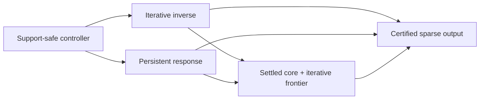

# Local solver family roadmap

**Status:** Working research organization, not an accepted complexity theorem.

The current risk-adjusted architecture combines persistent response state on a
settled core with local iterative repair on a changing frontier. This is a
research judgment, not a claim that every optimal local solver must be mixed.
A graph-uniform incremental response solver could eliminate most iteration;
an expanding-subspace first-order proof could eliminate persistent response.

## Three independent axes

| Axis | Alternatives | What it controls |
| --- | --- | --- |
| Graph access | Adjacency-list queries, supplied subgraph, global matrix | Which graph information is available and charged. |
| Support evolution | Fixed, nested, nonnested | Which principal systems occur and whether monotonicity/downdates apply. |
| Inverse realization | Iterative recurrence, persistent response, mixed | Where conditioning, state, update, and materialization costs occur. |

A nested active set does not by itself make a method an SDD/response method.
ASPR, expanding-subspace FISTA, and restarted restricted CG remain iterative
unless they retain elimination, Schur, or comparable inverse state.

## Common operator and controller

The shared PageRank operator satisfies

\[
Q=\alpha I+\frac{1-\alpha}{2}\mathcal L,
\qquad \alpha I\preceq Q\preceq I.
\]

For an active set `S`, every family realizes the same local Green operator
`G_S=Q_SS^-1`. After adding a batch `T`, the new block is governed by the
Schur complement

\[
K_T=Q_{TT}-Q_{TS}G_SQ_{ST}.
\]

The backend-neutral controller needs four conceptual operations:

1. `Expand(T)` incorporates a support-safe batch without silently
   materializing the old face.
2. `BoundaryBounds()` returns certified intervals for boundary KKT demands or
   residuals.
3. `Repair(tolerance)` reduces numerical error on the current face.
4. `Finalize()` materializes the terminal vector and certificate exactly once.

This is a mathematical interface, not an adopted API or residual convention.
Residual definitions remain governed by
[`decisions/residual-convention.md`](decisions/residual-convention.md).

## Architecture map



| Family | Strength | Current failure mode |
| --- | --- | --- |
| Iterative | Simple local row/coordinate access; condition-number acceleration is explicit. | Repeated prefixes, face resets, or unexplained expanding-support amortization. |
| Persistent response | Reuses settled structure and can remove repeated solves on paths/trees/bounded cores. | Dense boundary reporting, high-rank updates, and materialization can destroy locality. |
| Mixed | Separates a stable core from a small unresolved frontier and can share both proof families. | Must charge conversion, response maintenance, switching, validation, and both retained states. |

The exhaustive classification, roles, next targets, and formal dependencies
are in
[`../manuscript/notes/registry.toml`](../manuscript/notes/registry.toml).
Use `make note-report`, `make note-targets`, and `make note-graph` for derived
views rather than maintaining another note list here.

## Complexity template

For final charged active volume `V` and backend preconditioner `P_S`, define

\[
\kappa_{\mathrm{eff}}(S)
=\kappa(P_S^{-1/2}Q_{SS}P_S^{-1/2}).
\]

A useful conditional template is

\[
\widetilde O\!\left(
U_{\mathrm{response}}(V)
+V\sqrt{\sup_S\kappa_{\mathrm{eff}}(S)}+V
\right),
\]

where `U_response` includes factor updates, adjacency exposure, boundary
reporting, rekeys, interval refinement, state writes, validation, and eventual
materialization. With no graph-aware preconditioner, the spectral term is
naturally `O_tilde(V/sqrt(alpha))`. Near-linear response maintenance and
constant/polylogarithmic effective conditioning would approach the explicit
output scale. This is a proof template, not a general theorem.

## Canonical acceptance contract

On a finite simple undirected connected graph with unit edge weights,
at least two vertices, adjacency-list access, and one seed vertex `v`
(`s=e_v`), the desired
exact-real algorithm returns sparse
`x_hat` satisfying

```text
max_i |pi_hat_i-pi_i|/d_i <= eps_ppr
```

with one complete terminal certificate and return, while charging every
discovery, row read, numerical/response operation, rekey, query, state access,
materialization, and output. The target is

```text
O_tilde(1/(sqrt(alpha) eps_ppr)).
```

An RPPR route must state its bias conversion and terminal certificate. No
current route satisfies this contract graph-uniformly. A theorem for a
general sparse seed distribution is a stronger extension and must charge its
input, mixture or component work, merging, and output separately.

## Priority proof obligations

1. **AESP low-Dirichlet rate.** Prove a finite-sequence, graph-uniform
   windowed/spectral/nonlinear Lyapunov that survives residuals, retractions,
   positive-part mixing, and rekeys. The simple lagged Euclidean and unsplit
   weighted banks are insufficient in their audited forms.
2. **Actual multi-face reset accounting.** Replace additive payment of
   observable reset budgets by a nonadditive/logarithmic ledger on genuine
   nonsettled admissions, or derive a sufficient structural burn-in bound.
3. **Output-sensitive boundary response.** Maintain crossing information on
   high-rank nonequitable cores without dense target updates, one full flush
   per admission, or uncharged old-cut reads.
4. **Arbitrary-graph incremental response.** Extend structured append-only
   path/tree mechanisms to a stable output-sensitive solve-and-boundary
   interface.
5. **Lower-bound model separation.** Any new product lower bound must state
   which recurrence, representation, materialization, response, and output
   capabilities it excludes, and must defeat known constant-prefix and
   sparse-basis counteralgorithms.

The AESP--LOCSOR manuscript promotion gate is authoritative in
[`research_notes.md`](research_notes.md): the universal product claim stays
open until the early-locality lemma or a sufficient weaker route is proved.

## Experimental program

- Keep theorem regressions deterministic and separate from exploratory
  sweeps.
- Record graph, `alpha`, epsilon namespace, seed, stopping rule, and code
  version for every experiment.
- Use `make research-audit-fast` for representative exact/numerical claim
  checks and `make research-audit` for the full registered suite.
- Use dense response implementations only as correctness/switching oracles;
  their dense reads and materialization are not local-work evidence.
- Treat empirical SOR bands and frontier schedules as measured candidates
  until independently reproduced and connected to a proved mechanism.

## Stop/go rules

Continue a route only when it states its access model, accuracy namespace,
charged operations, evidence class, and next falsifiable claim. Stop or narrow
it when a proof silently scans a boundary, rebuilds a prefix, treats an
unknown optimum as algorithmic state, borrows future credit, or generalizes a
finite/algorithm-specific witness into a class theorem.
