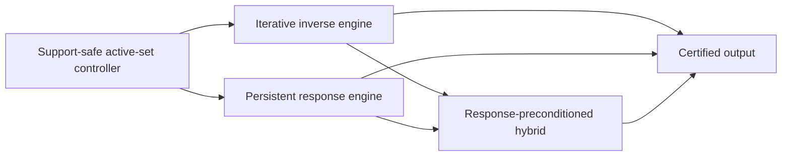

# Local Solver Family Roadmap

**Status:** Working research organization, not an accepted complexity theorem.

## Confidence statement

The project's current best risk-adjusted architecture combines persistent
response information with local iterative repair. This is a research judgment,
not a claim that every optimal local solver must be hybrid.

Two endpoints remain possible:

- a graph-uniform, output-sensitive incremental SDD/Schur solver could make the
  iterative layer unnecessary and improve the target all the way toward the
  explicit-output scale;
- a future expanding-subspace first-order method could attain the product scale
  without maintaining a nontrivial response representation.

The mixed architecture is valuable because it interpolates between these open
endpoints. It also gives a common place to reuse the project's proved support
gates, response identities, iterative convergence results, and counterexamples.

## Three independent axes

Do not identify the following choices.

| Axis | Alternatives | What it controls |
| --- | --- | --- |
| Graph access | Adjacency-list queries, supplied subgraph, global matrix access | Which graph information is available and charged. |
| Support evolution | Fixed, nested, or nonnested | Which principal systems occur and whether monotonicity or downdates are available. |
| Inverse realization | Iterative recurrence, persistent response, or a mixture | How the restricted inverse is represented and where condition-number dependence enters. |

In particular, a nested active set does not make an algorithm an SDD method.
ASPR, expanding-subspace FISTA, and restarted restricted CG use nested sets but
remain iterative unless they maintain an elimination, Schur, or comparable
graph-aware inverse representation.

## Common operator

The shared PageRank matrix is

\[
Q=\alpha I+\frac{1-\alpha}{2}\mathcal L,
\qquad
\alpha I\preceq Q\preceq I.
\]

For an active set \(S\), all solver families act on the same local Green
operator

\[
G_S:=Q_{SS}^{-1}.
\]

If \(S^+=S\cup T\), the new block is governed by

\[
K_T=Q_{TT}-Q_{TS}G_SQ_{ST}.
\]

The iterative family realizes \(G_S\) temporally through repeated row,
gradient, coordinate, splitting, or Krylov operations. The response family
realizes it spatially through elimination, factors, Schur complements, or
directed messages. A mixed method keeps a response for a settled anchor and
iterates on a smaller unresolved frontier.

## Backend-neutral controller

The active-set controller should depend on a small conceptual interface:

1. `Expand(T)`: incorporate a support-safe batch without materializing every
   old coordinate.
2. `BoundaryBounds()`: return certified intervals for boundary KKT demands or
   residues.
3. `Repair(tolerance)`: reduce numerical error on the current face.
4. `Finalize()`: materialize the terminal vector and its certificate once.

The interface is mathematical rather than an adopted implementation or
stopping-rule convention. Exact residual formulas remain note-scoped while
`docs/decisions/residual-convention.md` is open.

## Family map



The exhaustive per-note classification is machine-readable in
[`../manuscript/notes/taxonomy.toml`](../manuscript/notes/taxonomy.toml). Run

```bash
make note-report
```

to print its current Markdown table, or

```bash
make note-audit
```

to check it against the note manifest, note directories, build list, and
dependency graph.

## Complexity template

Let \(V\) denote the final charged active volume and let \(P_S\) be the
backend's current SPD preconditioner. Define

\[
\kappa_{\mathrm{eff}}(S)
=
\kappa\!\left(P_S^{-1/2}Q_{SS}P_S^{-1/2}\right).
\]

A useful conditional target is

\[
\widetilde O\!\left(
U_{\mathrm{response}}(V)
+V\sqrt{\sup_S\kappa_{\mathrm{eff}}(S)}
+V
\right),
\]

where \(U_{\mathrm{response}}\) includes all factor updates, adjacency
exposure, boundary reporting, rekeys, interval refinements, and state writes.
This expression is a proof template, not an established general theorem.

- With no graph-aware preconditioner, the spectral term is naturally
  \(\widetilde O(V/\sqrt\alpha)\).
- With a constant-quality response preconditioner but quadratic response
  maintenance, the repeated-prefix obstruction remains.
- With constant or polylogarithmic effective conditioning and
  \(U_{\mathrm{response}}(V)=\widetilde O(V)\), the target approaches
  \(\widetilde O(V)\).

## Current note routing

### Iterative track

Use this track for methods whose strongest graph-dependent primitive is a
local recurrence or restricted first-order/Krylov solve:

- `aesp_cd_l1_rppr`;
- `aesp_locgd_star_lower_bound`;
- `aspr23_bound_audit`;
- `volume_gated_acceleration`;
- `evolving_support_cg`;
- `rlsor_terminal_exact_rung`;
- `frontier_adaptive_ladder`;
- `two_rung_sor`.

The phrase "exact rung" in the empirical SOR notes refers to unit coordinate
settlement. It is not by itself an exact restricted block solve.

### Response track

Use this track when persistent elimination or response state is the principal
algorithmic resource:

- `incremental_active_set_sdd`;
- the path, tree, bounded-block, shell, and quotient response solvers inside
  `delayed_reflection_ladder` and `propagate_settle_framework`.

For bounded biconnected blocks, ordinary adjacency access is now sufficient:
zero-prefix invariance at activation events permits online block mergers and
future-only response rebuilds.  Stable block identifiers are no longer an
assumption for the product-scale theorem.

### Mixed track

Use this track when propagation or acceleration and response settlement are
both essential:

- `adaptive_revisit_control`;
- `hybrid_aesp_locsor` after its three-arm, branch-seeded double-Y, and
  strict-range canonical branch-caterpillar common-state response handoffs;
- `two_rung_direct_theory` after its Schur-deflation extension;
- `delayed_reflection_ladder`;
- `propagate_settle_framework`;
- `response_preconditioned_hybrid`.

The common-state switching interface is exact through the first genuine
branch, and the underlying response interface now reaches one fixed
two-branch core. For `0 < alpha < 1` and `0 < rho < 1/3` in exact real-cell
arithmetic, a center-seeded three-arm spider has a `kappa = 1`
activation-token countdown for every legal certified batch order, using one
affine transfer product per actual arm prefix and two root scalars. Its full
exposure, response, control, state, recovery, and output ledger is
`O(C(S*)) = O(1 / rho)`. A fully charged gate-compatible Phase-I prefix can
discard its signed numerical state, reconstruct those actual common arm
prefixes in one pass, and continue with this response without private replay.
The resulting total is `B_J^full + O(C(S*))`; product work follows only from an
independent bound on `B_J^full`.

On the double-Y seeded at branch vertex `o`, `s=e_o`, four pendant-prefix
products couple through one scalar before the adjacent branch is admitted and
through a fixed-size SPD `2 x 2` Schur core afterward. For `0<alpha<1` and
`0<rho<1/3`, the same exact-real activation-token tightness `kappa=1` and fully
charged `O(C(S*))` work hold for every legal batch order. With
`zeta=(1-alpha)/(1+alpha)` and
`rho_link(alpha):=zeta/[3(3+zeta)]`, `rho<rho_link(alpha)` forces entry into
the rank-two phase. Every fully charged gate-compatible Phase-I prefix now has
a paid common-state conversion to this response, with no private replay. The
prefix and post-handoff theorems report all eleven coordinates; the latter
includes constant-size external certificate emissions at every declared
interaction stage. The total is `B_J^full + O(C(S*))`, so product work still
requires an independent bound on `B_J^full`. No estimate-sequence energy is
transported, and no other-seed, graph-uniform, or finite-precision theorem
follows.

The first growing branch-core test separates one failed representation from
the still-live implicit route. For each fixed `m`, branch seed `s=e_(b_1)`,
`0<alpha<1`, and family-dependent
`0<rho<rho_cat(m,alpha)<=1/3`, one legal exact-KKT positive-subset singleton
order reaches an `m`-vertex tridiagonal branch core and then appends a
length-`m` endpoint arm while `m+1` positive leaf tips are deferred. Every arm
append changes every deferred exact tip demand. The literal exact-cell
`EagerTipKey` state, which keeps separately addressed values and forbids lazy
indirection, therefore performs at least `m(m+1)` old-key writes. This is not
the canonical all-violations order, no `m`-uniform positive `rho` range is
claimed, and it is not a lower bound for implicit, lazy, sign-persistent, or
kinetic/group reporters or finite-precision implementations. A balanced
affine-transfer tree still gives a named attachment-cell update, branch
append, or tip query in `O(log(2+m))` exact work and `O(m)` retained cells.
For the explicit backbone-first policy, the exact
`CaterpillarKineticDelta` state now upgrades those point queries to an
all-positive delta reporter: every strict tip crossing is keyed in one
monotone scalar, emitted once, and charged through a heap, for total
`O(m log(2+m))` work and `O(m)` retained cells. This remains a fixed-`m`,
branch-seeded, family-dependent-`rho`, exact-real result. It does not cover the
pre-backbone phase, repeated full-list output, a uniform positive `rho` range,
finite precision, or a graph-uniform reporter.

The actual canonical policy is now closed on the smaller strict range
`0<rho<rho_can(m,alpha)<=rho_cat(m,alpha)`. Its exact all-violations trace has
exactly `m` three-label distance-layer batches. The exact-real
`CaterpillarCanonicalLayerDelta` reporter charges localized absorption and
transfer-cell updates, balanced parent-coordinate queries, every demand test
and delta/certificate exchange, recovery, validation, materialization, and
terminal output in `O(m log(2+m))` work and `O(m)` state. This is still a
fixed-`m`, branch-seeded, delta-only result; it proves neither `kappa=1` nor
PPR conversion, and it claims no positive `rho` range uniform in `m`.

On that same strict canonical range, any fully charged Phase-I prefix ending
at an actual checkpoint now has a paid support-only hybrid handoff. One direct
pass constructs the current arm/leaf absorptions, tridiagonal branch cells,
and balanced transfer state, then invokes `CaterpillarCanonicalLayerDelta`
without replaying or querying any prior face. The exact-real total is
`B_J^full + O(C(S*) log(2+C(S*)))`, with all eleven prefix and suffix resource
coordinates explicit. Product work still requires an independent fully
charged bound on `B_J^full`; no estimate-sequence energy is retained. The
uncapped instruction “run any finite valid burn-in” cannot provide that bound:
arbitrarily many valid exact-inner Catalyst stages may leave the common
checkpoint at `Uhat_0={b_1}` while adding `Omega(N)` control work.

The named `Full-BC-AESP_0` policy provides one positive comparator for the
promised fixed family only. For `m>=2`, `alpha<1/2`, and `rho<rho_can`, it pays
a complete traversal, certifies the full envelope `U=V=S*`, runs exactly
`T_*=ceil(2 log(4)/sqrt(alpha/(1-alpha)))` relative-accuracy AESP-CD stages,
and invokes no gate before handing off at `k=0`. Its full prefix vector is
`(O(D_*),O(D_*),0,O(C_*),O(H_*),O(D_*),0,O(C_*),O(C_*),O(D_*),0)` and its
authoritative work is `O(H_*)`; composing the separately charged response
costs `O(H_*+C_* log(2+C_*))` and returns the exact RPPR optimum. The soft
product shorthand hides `log(1/(1-2 alpha))` and is not uniform as `alpha`
approaches `1/2`. The policy exposes all realized support before acceleration,
discards its proved half-gap at handoff, and is not adaptive locality, a
general prefix theorem, graph-uniform work, finite precision, or PPR
conversion. The next mixed-track steps are a capped automatically exploring
accelerated Phase I, the remaining canonical range
`rho_can<=rho<rho_cat`, other seeds or policies, arbitrary pre-backbone
interleavings, and the separately charged full-list interface.

The response-native `FirstLayer-BC_1` policy now closes one local actual
nonzero-checkpoint comparator on that same fixed family and strict range. It
scans exactly `Uhat_1={b_1,b_2,a_1,r_1}`, commits the first canonical batch,
settles that face exactly, and retains its native response state. Admitted
support, exact numerical support, and scanned rows coincide; only the next
layer's labels are known without row exposure or admission. Its prefix vector
is `(9,2,1,0,O(1),0,O(1),O(1),O(1),Theta(1),Theta(1))`, and the post vector
`eq:branch-caterpillar-first-layer-post-eleven-vector` charges the remaining
`m-1` batches and terminal return. In-place continuation has the authoritative
exact-real bound `O(C(S*) log(2+C(S*)))`. This is response-native RPPR
settlement and claims no accelerated locality.

The sharp signed-gate calculation explains the remaining accelerated gap. At
checkpoint `k`, a boundary demand changes by
`beta_(k,v)(z_parent-x_parent)`, so a symmetric certificate needs radius below
`mu_k=min_v g_(k,v)/beta_(k,v)`. Zero initial objective gap is exact and runs
zero stages. For positive gap, the imported relative-gap route gives only the
sufficient cap
`T>(2/sqrt(alpha/(1-alpha))) log_+(4 Delta_(k,0)/(alpha mu_k^2))`, and each
relative-oracle stage retains the explicit `log(1/(1-2 alpha))` term. The old
constant half-gap does not imply this comparison. A capped accelerated local
splice must therefore pay the margin interface or prove a stronger charged
one-sided certificate; this proposition is not a lower bound against exact
settlement.

### Model and synthesis track

Use this track for scope control, lower-bound models, and cross-note ledgers:

- `local_solver_oracle_hierarchy`;
- `hybrid_local_solver_complete_note`;
- `hybrid_local_solver_synthesis`.

## Priority proof obligations

### P0: finite-band response on general cyclic cores

Maintain enough of the boundary response to decide all demands outside a
prescribed normalized KKT band. Charge every old-face read, factor update,
rekey, ambiguity refinement, and reported activation. Exact zero-sign
maintenance is not required for approximate output.

This is the weakest known response theorem that plugs into the proved
finite-resolution continuation result in `propagate_settle_framework`.
The causal block-merge theorem closes this obligation for bounded blocks; the
P0 case is therefore a large nonequitable cyclic core, not block metadata
maintenance.

The finite-band interface is now margin-adaptive. Certified lower endpoints
drive safe admission, certified upper endpoints drive termination, and no
uniform pointwise estimate or coordinate-specific response leverage is
required. Exterior response changes are energy contractions, so degree volume
moving by a normalized margin is shock-packed. Source-aware squared leverage
is exactly terminal Schur-diagonal loss and telescopes to at most
`(1-alpha)/2` per still-exterior label. Chebyshev inverse-square-root probes
construct a complete one-sided boundary-loss checkpoint in
`O_tilde(cvol(S)/sqrt(alpha))` work, and geometric checkpoints sum to the same
final-volume product scale. Between checkpoints, Chebyshev whitening accepts
any constant-factor spectral frontier, replaces exact inverse-square-root
source solves, and costs `O_tilde(T_mv/sqrt(alpha))`. A positive geometric
resolvent ladder gives a second construction: its shifted work mass and
monotone Schur-coordinate settlement ledger are `O(1/sqrt(alpha))`, every
rung is a sparse shifted face system, and every unfinished solve is exact
nonnegative anchor debt. On one exact-real fixed `(A,F)` partition, exposed
cut, and ladder, aggregation plus signed Chebyshev semi-iteration now realizes
all that debt: the scalar recurrence costs
`O_tilde(cvol(T)/sqrt(alpha)+C_frag)`, `r` source columns are charged as the
sum of their runs, and signed sources use `2r` nonnegative streams. The energy
certificate gives mathematical exterior intervals only. The named
non-output-sensitive `AllBoundaryFlush` pays the cut scan, interval
computation/classification, materialization, validation, memory, rounds, and
emission in its full eleven-vector. The remaining P0 primitive is therefore
an output-sensitive partial flush or equivalent target-side sparse-recovery
interface between checkpoints, without refreshing the full boundary.
The first fixed-face stress test rules out only one literal representation of
that primitive. On the frozen notched-double-sun face containing all anchors
and source petals, with fixed `n` and sufficiently near-one `alpha`, unit
first-rung fragments create exactly one new report crossing per event at gate
`g=((1-alpha)/2)^(5/2)` and band `g/2`, while every exact response increment is
dense. The named separately addressed `EagerExactSlack` state must therefore
read and overwrite `Theta(p n^2)` exact cells and pay the same response,
control, and materialization scale for only `Theta(r n)` delta/certificate
output; `p=r` for nonnegative columns and `p=2r` for signed certification. The
complete charge is `eq:notched-sun-eager-eleven-vector`. This is a fixed-face
exact-real debt/query obstruction, not an RPPR chronology or a lower bound on
implicit cyclic transfer, packed coded queries, scale-truncated state,
on-demand validation, or any general partial reporter.
On the prescribed notched-double-sun structural trace, exact diagonal-loss
updates have linear fixed-decoder dimension for each fixed size when `alpha`
is sufficiently close to one. This stops only the universal exact linear-tag
shortcut; scale-truncated, nonlinear, coded, and cyclic-transfer reporters
remain live. One fixed-event signed hash-and-bit bank now locates every
potentially ambiguous row with output-sized target dimension and candidate
count, but its harmonic construction, adaptive refresh, workspace, and exact
validation are not yet dynamically charged. Conversely, at threshold
`((1-alpha)/2)^5`, the same notched-sun trace reduces to one hierarchy path
only for fixed size and `alpha` above a size-dependent near-one threshold;
this is not a uniform fixed-`alpha` theorem.

That structural trace is now known not to be a canonical single-seed RPPR
`F`-only chronology. At every relevant common face, each unseeded matched
frontier/report pair `f_i,w_i` has identical exact demand and the canonical
all-violations gate co-admits it; one seed distinguishes at most one pair. The
finite-band consequence applies only to one simultaneous uniform
point-estimate call at that face, not to arbitrary asynchronous interval
refinement. The rank and representation audits remain valid, but no reporter
lower bound follows from this graph. A replacement P0 witness must first break
the symmetry and prove its canonical KKT admission trace before reporter
analysis.

The minimal degree-lift repair also fails that legality test. Pairing the
degree-two reports makes the raw anchor--report cut full rank while leaving
degree-one source petals and degree-four anchors. For every `0<alpha<1` and
`rho>0`, with `vartheta=(1-alpha)/2`, report quietness bounds every anchor by
`4 alpha rho / vartheta`, a positive petal demand requires more than
`2 alpha rho / vartheta`, and the nonseed anchor equation contradicts that
band. Consequently every canonical prefix that remains report-free contains
at most one source petal. This is a KKT-legality obstruction despite the
rank-`n` raw cut, not a reporter lower bound or a one-Green-direction
collapse. The next attempted repair replaced each direct report spoke by an
active relay with an unadmitted endpoint.

That two-edge active-relay repair is now also stopped. At every `W`-free
canonical face, the canonical all-violations batch containing a nonseed relay
also contains its degree-one petal unless that petal is already active. Thus a
common face with all relays already has at least all but one petal and cannot
be followed by a linear petal-only epoch, despite full-rank raw anchor--relay
and relay--report cuts. This remains only a KKT chronology obstruction: paired
petal--relay batches are possible, arbitrary positive-subset policies are not
covered, and no reporter lower bound follows. This motivated two tests:
raising the exterior petal degree to three with a petal cycle, and feeding
relays from an independent active backbone. Both are now resolved below, and
neither supplies a legal long report-free trace on its intended seed orbit.

The degree-three petal-cycle option is now retired too. Its isolated
relay-before-petal window is real, but global anchor balance exhausts that
window. For every `0<alpha<1`, `rho>0`, and seed orbit, if a `W`-free
canonical face contains all relays and its next all-violations batch is also
`W`-free, then at most one petal is still inactive. If a report enters with or
before the last relay, or in the first post-last-relay batch, the intended
report-free epoch has already failed. This is canonical all-violations KKT
chronology only: arbitrary positive-subset policies, reporter work, response
rank, scan/output lower bounds, stability, and finite precision remain open.
Feeding relays from an independent active backbone is now stopped for the
intended backbone-seed orbit as well. On the even double-cycle feed, every
report-free canonical prefix from a backbone seed is petal-free: report
quietness caps the maximum active anchor at its petal threshold, while every
newly positive anchor has its relay already active or co-admits it in the same
all-violations batch. Hence the first petal batch contains a report. The seed
scope is essential: for an anchor seed, `0<rho<(1-alpha)/8` gives an exact
report-free first-petal batch, but its exact continuation also stops. For every
even `n>=6` in that counterrange, at most the seed petal and its two neighboring
petals enter before the first report; the first `j+/-2` petal batch co-admits
`w_j` unless a report entered earlier. The relay-seed orbit is now exhausted
too. For every even `n>=4`, `0<alpha<1`, and `rho>0`, its singleton either
does not initialize, terminates, or admits the incident report in its first
propagating batch, possibly with the backbone vertex. Thus the double-cycle
family is retired only for the prescribed canonical long report-free
later-petal witness. These are KKT chronology stops, not claims about later
faces, arbitrary positive-subset policies, reporter work, response rank,
stability, finite precision, or every cyclic family. The next P0 legality test
must use a different coupling or bounded-degree settlement gadget. In every
case, prove every seed orbit and genuinely changing response directions before
analyzing a reporter representation.

The earlier prescribed notched-double-sun structural trace also rules out one
literal adaptive implementation. Rebuilding and storing a fresh explicit
dense harmonic table at every event incurs an unsuppressed anchor-size factor
in table-cell writes, even after the source and target randomness, summable
failure schedule, candidate cap, and validation are charged correctly. This
is not an RPPR trajectory or a finite-band reporter lower bound. It leaves
implicit multi-right-hand-side solves, batched or compressed row access,
charged unused block pools, dynamic terminal sparsifiers, cyclic transfer
state, and sparse recovery live. After an asymmetric legal canonical KKT
chronology has first been proved, the next P0 construction must give an
aggregate epoch charge for one of those representations rather than rebuild
the explicit table.

### P0: expanding-subspace acceleration without repeated restarts

Maintain a support-safe lower certificate separately from signed accelerated
variables. Extend the estimate sequence when the certified face grows, rather
than restarting a complete accelerated solve after each singleton expansion.

The fixed-envelope rate and safe-centered inner locality are already available
in `aesp_cd_l1_rppr`. Each positive log-inflation term is now bounded by an
a-posteriori normalized collateral-clipping fraction, with exact collapse
amplitude from stage two onward; this fraction may overcharge a benign round.
The exact continuation target is cumulative accelerated-scale packing or a
locally checkable surrogate. A singleton-support single-edge family has a full
correction every other stage but zero inflation, so raw correction count
cannot be charged to support additions. A second exact single-edge family has
full optimal support and a harmful stage-two collateral charge of order `q`,
but only order-`q^2` monotone Euclidean log-progress. It rules out every
`o(1/q)` Euclidean-log coefficient for the analytical collateral charge,
including constant and polylogarithmic coefficients. It does not refute the
actual cumulative log-inflation, a multistep collapse-aware potential, or a
different locally checkable surrogate. The broader one-sided
expanding-subspace obligation remains isolated in `volume_gated_acceleration`.

An exact endpoint-edge calculation now removes the simplest interpretation of
that obligation: in its stated admissible `rho=tau` range, zero-padding cannot
carry any fixed-face-exact energy through one safe admission with no additive
shock term. The first enlarged-face step
retains a positive fraction of the exact Schur gain even when the old-face
energy and momentum are zero. This is only a pointwise counterexample; it does
not refute the global zero-start recurrence, cumulative shock packing, or a
newly admitted-volume ledger.

The first explicit transport identity is now proved. If `d` is the exact
restricted-optimum displacement for one safe expansion `U` to `U+`, shifting
the estimate center by `d` gives

```text
E_(U+)(x, v+d) = E_U(x, v) + Delta_B,
```

and the nonnegative Schur gains telescope over nested faces. This is a
modified transported-center recurrence, not a proof for the literal
zero-padded momentum. On endpoint paths, an append-only exact `LDL^T`
response stores centered momentum `v-x_U*`; appending one zero state coordinate
represents the dense optimum shift without rewriting the old prefix. New
incidence exposure, factor and Schur append/query, admission control, and state
appends are charged to newly admitted volume. The full eleven-vector still
charges every old-face recurrence read, response application, envelope check,
state write, terminal validation, materialization, memory cell, and output via
the swept-volume and final-volume coordinates.

The exact weighted-shock ledger now identifies what remains. With
`q=sqrt(alpha)`, `theta=1-q`, gains `Delta_s`, and remaining face gain
`H_t=sum_(s=t)^(T-1) Delta_s`, summation by parts gives

```text
W_T = theta^(T-1) H_0
      + q sum_(t=1)^(T-1) theta^(T-1-t) H_t.
```

Thus late weighted shocks charge discounted occupancy of future face gain,
not merely its unweighted telescope. A terminal-edge execution with
`T=2`, `J=1`, final support volume `2`, and swept volume `3` has
`W_T / (q sum_s Delta_s)=(1-q)/q`; consequently no universal
`C q sum_s Delta_s` bound can close this ledger. This exact endpoint-path
counterexecution refutes only that shortcut. It is not a lower bound on
`T`, swept volume, or implementation work, and it leaves terminal floors,
other potentials, branching/cyclic responses, and floating-point analysis
open.

The first zero-start growing-path separation is now exact but deliberately
accuracy-driven. It uses the endpoint seed and ambient path degrees on a
finite path with exactly `N=L+1` edges. For `q=1/n` with integer `n>=2`,
`L=n^2`, and
`rho=tau=(q/3)((1-q)/(1+q))^L`, the terminal certificate forces at least `L`
singleton admissions and `T>=L`, while the literal full-prefix implementation
has

```text
mathfrak V_T >= L^2 = q^(-4),
nu_fin/q = Theta(q^(-3)).
```

This refutes only a log-free `O(nu_fin/q)` charge for that exact-real named
implementation. The certified extra `1/q` factor is
`Theta(log(q/rho))`, and no matching upper bound on actual swept volume is
proved, so soft-order and implicit bounds remain open.

The constant-ratio baseline is now exact. For `rho=tau=q/5`, `0<q<=1/4`,
the zero-start endpoint path has
`J,nu_fin=Theta(1/q)`, `T>=J`, and
`mathfrak V_T=Omega(q^(-2))=Omega(nu_fin/q)`. This is only a product-scale
floor. It does not prove the observed `T=Theta(q^(-2))` or
`mathfrak V_T=Theta(q^(-3))` laws and gives no product separation. An exact
`q=1/5` chronology also rules out frontier-only gate logic: a global
safe-envelope correction maximized at the seed suppresses a raw stage-6
frontier violation, and after the next admission the maximizer moves to old
interior vertex `v_2` by stage 9. A moving-maximum energy argument now controls
that full correction without locating its maximizer. With
`K_q=ceil(log(50(1+q^2)^2 q^(-10))/(-log(1-q)))`, every visited face admits
or certifies within `K_q` consecutive fixed-face steps, so the exact-real
zero-start transported-center execution satisfies
`T<=(J+1)K_q=O(q^(-2) log(1/q))` and
`mathfrak V_T=O(q^(-3) log(1/q))`. Its named literal full-prefix ledger
is `(Theta(q^-1),Theta(q^-1),1,0,O(q^-3 log(1/q)),`
`O(q^-3 log(1/q)),O(q^-3 log(1/q)),Theta(q^-1),O(q^-1),`
`O(q^-3 log(1/q)),Theta(q^-1))`, in the shared order. It has one terminal
external return. These
upper bounds neither prove the sampled `Theta` laws nor give matching lower
bounds, logarithm removal, or a product separation. The proved `O(new volume)`
factor append still cannot pay old-face sweeps outside this literal path
analysis; the zero-padded recurrence, branching/cyclic graphs, intermediate
emissions, and finite precision remain open. The next proof should remove the
single logarithm or supply matching exact space--time lower bounds before
extending the centered response beyond paths.

One Round-013 spectral route toward that lower bound was quarantined. Under
inactive projection, the conditional fixed-full-face recurrence has the
derived damped-cosine roots, but the roots do not determine the actual state
coefficients on entry or prevent cancellation in the moving residual range.
The finite exact instances remain scaffolding only. There is no proved
terminal logarithmic block, asymptotic lower eleven-vector, or refutation of
`K_face=O(q^-1)`. Logarithm removal versus necessity is still the precise open
question; a valid lower route must derive the literal entry coefficients and
an explicit anti-cancellation bound, while an upper route must retain the
moving global correction.

For the mixed response-preconditioned direction, the numerical accumulation
part is now closed: arbitrary approximate Schur-frontier corrections lift into
mutually `Q`-orthogonal subspaces, so their energy errors add in quadrature and
no old face is numerically restarted. The remaining mixed-track obligation is
to apply those lifts and report finite-band crossings within the charged
response budget. This does not solve the response-free estimate-sequence
problem above.

Static group-trace evaluation is also reduced to a logarithmic number of
source-normalized Gaussian response sketches: with high probability their
squared subtree sums give constant-factor masses for every hierarchy node
simultaneously. This static reduction does not by itself avoid dense exterior
updates or justify reusing one signed sketch along an adaptive trace.

The adaptive-sketch issue is now separated from that data-structural theorem.
At event j, draw fresh probes only after the new frontier space is fixed and
add their nonnegative squared masses with a summable conditional failure
budget. The normalized frontier spaces are mutually energy-orthogonal, and a
newly exposed boundary label has zero response to every older space. Thus all
prefix estimates remain valid without replay. What remains is the local
implementation of one signed normalized response followed by its squared-mass
range-add on the live hierarchy. Equivalently, the accumulated group mass is
the weighted decrease of the same terminal Schur diagonals from the initial to
the current face. A certified one-sided estimate may have additive error at
the current pruning scale, so the implementation need not estimate negligible
groups multiplicatively or retain the random source dimension.

At a fixed anchor, a target-side Gaussian sketch removes that all-leaf update:
each reached hierarchy-node mass is estimated by polylogarithmically many
scalar transposed harmonic measurements. Combined with the packed locator,
the measurement count is output-sensitive. The remaining oracle is now a
dynamic local scalar harmonic query—including acquisition of the requested
target row—or one shared sparse-recovery bank whose precomputed rows cover
all reached nodes within the same ledger. The positive resolvent ladder is an
alternative that uses no precomputed target row: it emits cut response during
sparse shifted propagation and retains the unpropagated part as exact
nonnegative anchor debt.

The group query is completely charged when the normalized anchor--boundary
cut has rank `s`: one bank of `s` anchor harmonic solves represents the
harmonic term, while additive low-dimensional Gram/direct summaries give
every hierarchy-node squared norm exactly. Only source Gaussian probes remain.
Hence polylogarithmic cut rank joins bounded blocks and equitable quotients as
a closed structural regime. A comb tree shows why this is not the
general proof: its linear-volume active path has linear cut rank, a dense
full-rank harmonic bank, and constant best rank-deficient energy error. The P0
oracle must therefore be lazy or dynamically sparsified on high-cut-rank
nonequitable cores; universal low-rank materialization is ruled out.

Full anchor initialization is no longer part of that open oracle. A Chebyshev
polynomial approximating `Q_SS^(-1/2)` applies logarithmically many Gaussian
probes to the entire exposed boundary at once and gives simultaneous
one-sided diagonal-loss estimates. Its degree is
`O(alpha^(-1/2) log(1/(alpha*epsilon)))`, so every geometrically spaced full
checkpoint is absorbed by the accelerated final-volume ledger. Small
post-checkpoint increments cannot be recovered by subtracting noisy
cumulative snapshots. Their source side is nevertheless closed: for a
spectral approximation `K_tilde` of the frontier Schur complement, a
Chebyshev polynomial prepares all Gaussian source probes once in
`O_tilde(T_mv/sqrt(alpha))` work and preserves every group mass within an
explicit constant. The positive shifted-resolvent construction additionally
turns this source normalization into logarithmically many monotone exact rungs
with the correct alpha work mass. Literal nonnegative row settlement can lose
the gain even on one edge, but the fixed-face graph bridge is now closed:
aggregate every outstanding debt first, use signed Chebyshev semi-iteration
internally, and convert the resulting energy certificate into one-sided
exterior intervals. This theorem freezes `(A,F)`, the exposed cut, and the
ladder. Its scalar sparse-recurrence work is
`O_tilde(cvol(T)/sqrt(alpha)+C_frag)`; `r` nonnegative columns multiply graph
work through the sum of their actual runs, and signed columns split into
`p=2r` nonnegative streams without pre-certificate cancellation credit. The
interval family is mathematical until the non-output-sensitive
`AllBoundaryFlush` scans the cut, computes, materializes, classifies,
validates, and emits every boundary interval. Its fragment/control, response,
memory, round, full-face-write, materialization, and output coordinates remain
explicit. With fixed column count, one such fully charged flush per
geometrically growing fixed-decision face has the final-volume product bound.
Literal geometric sleep is nevertheless refuted by an ambient-degree,
single-seed path whose family-dependent `rho_n` forces canonical
all-violations singleton prefixes while successive charged-volume ratios tend
to one; no path-length-uniform positive `rho` is asserted. The exact-real
linear comparator has `R_int=n`, so this is a scheduling obstruction, not a
path work or round lower bound. The precise open operation is an
output-sensitive partial flush/shared sparse-recovery application between
checkpoints, or a different proved support-safe trace.
On the coded-bank side, first-failure reuse leaves one target bank per doubling
capacity, and an exact bidirectional rent-or-buy rule uses at most twice the
smaller of target rows and cumulative source width in anchor right-hand sides.
The remaining implementation charge is repeated source-side anchor-cut scans
or target-side stored-response reads, not target dimension or solve count.

The two available telescopes should be used together, not as separate update
clocks. For a still-exterior label or fixed hierarchy node, the response
uncertainty accumulated during an epoch is bounded by the square root of its
Schur-diagonal loss times the orthogonal correction energy spent in that
epoch. Disjoint wake-up epochs therefore obey a geometric-mean budget. For a
unit seed, a label `v` awakened at margin `Theta(alpha*tau)` is awakened only
`O(1/(tau*sqrt(alpha*d_v)))` times. The recommended scheduler is consequently
to let a hierarchy node sleep until the product of its accumulated loss and
energy reaches the current pruning scale. Publishing every additive
`alpha*tau` key change throws away this square-root gain. This is still a
per-label statement; an exposure-charged aggregate implementation is needed
before summing it into a graph-uniform work bound.

### P0: response-preconditioned composition

Keep a settled anchor \(A\), a frontier buffer \(F\), and the implicit block
response

\[
Q_{FF}-Q_{FA}Q_{AA}^{-1}Q_{AF}.
\]

Use geometric rebuilds for large frontier growth and low-rank or iterative
repair for small growth. Materialize the old-face correction only at final
output.

The dense reference backend now identifies a useful switching safeguard: give
every newly enlarged frontier one converged reduced-system probe before a
volume-triggered rebuild. A center-seeded star is a heavy batch but its Schur
frontier solves in one CG step, so immediate factor-two rebuilding is wasteful.
This is measured policy evidence, not an amortized local-work theorem.

The boundary-deflation theorem in `two_rung_direct_theory` now supplies one
exact structured preconditioner for this interface. Certified closed forest
decorations can be peeled in linear work; their lifted generalized eigenvalues
are exactly one, and the remaining effective condition number is precisely
that of the Schur 2-core. Thus acyclic decorations are no longer part of the
P0 conditioning problem. Online closure certification and finite-band
reporting on the remaining nonequitable cyclic core are still open. Absorbing
one closed component produces exactly one Green-column update and one
nonnegative exterior range-add vector, matching the response reporter's
current heavy-change primitive.

The fixed-attachment cycle case is now closed at the reporter level. Given
supplied certified closed pendant components that all attach at one core
vertex `p`, exact-cell `FACR(p)` keeps one Green direction and two monotone
gate pointers. It reports absorption-only upward crossings in
`O(V_fin + |R| log(2 + |R|) + Z)` total work, including certificate
verification/scanning, response construction and application, exact
validation, forest recovery, and output, with separate `O(V_fin)` memory and
no materialized global boundary-key rekey. This does not discover closure
online, maintain a post-repair terminal queue, handle varying attachments or
response-rank growth, or provide a finite-precision guarantee. Those are the
next cyclic composition tests.

The newest response lemma gives a sharper reporter target. If a correction is
generated by a frontier batch `B`, its source-aware squared exterior
leverages sum to at most `|B|`. Thus the degree volume whose certified interval
can meet a prescribed transition margin is bounded before the dense correction
is materialized. A matched-edge example shows that a source-oblivious uniform
energy interval can still refresh the entire boundary after a one-row change.
A rank-sensitive branch-and-bound lemma further proves that constant-factor
subtree leverage-mass queries locate all candidate rows with probe count
controlled by the packed batch-rank/energy budget and hierarchy depth. The P0
data structure can therefore be stated as a dynamic aggregate
Schur-diagonal-loss oracle with scale-matched additive error, equivalently a
source-conditioned group-trace oracle; uniform global error clocks are not
sufficient.

There is a close external blueprint: the dynamic electrical-flow locator of
[van den Brand et al.](https://arxiv.org/abs/2112.00722) combines dynamic
spectral vertex sparsifiers with an $\ell_2$ heavy-hitter recovery map to find
large-energy coordinates. This supports the proposed architecture, but does
not supply the theorem here: its preprocessing and update bounds are measured
against the ambient graph and its resistance-update sequence. A valid import
must instead handle monotone terminal additions, vertex boundary demands,
adaptive finite-band intervals, and charge every sketch/Schur operation to the
locally exposed volume.

The import is algebraically exact after diagonal scaling: the PageRank
Stieltjes matrix is congruent to the grounded Laplacian with conductance
`(1-alpha)/2` on original edges and `alpha*d_v` from each vertex to ground.
Moreover, the response operator for a face depends only on its internal edges,
cut incidences, and boundary degrees; edges wholly in the unexposed exterior
are irrelevant. Static locator input is therefore exposure-sized, and
geometric rebuilding can already be charged to final active volume. The next
construction attempt should specialize that locator rather than invent a
response hierarchy from scratch: maintain exposed-terminal Schur state within
each epoch, recover degree-scaled vertex-response heavy hitters, wake nodes by
the loss--energy product, and exactly test only the finite-band candidates.
The proof must account separately for terminal additions, epoch-internal
locator refreshes, candidate tests, and rebuilds.

The exact interface between the iterative frontier and this locator is now
available. At a fixed anchor, precompute transposed harmonic extensions for
the rows of any chosen linear boundary sketch. Once the iterative arm solves
the Schur-frontier system, the full exterior dual-update sketch is obtained
from scans of the frontier incidences and reads of the touched stored sketch
rows; the known frontier source is subtracted. The dense old-face correction
and the ambient boundary are never materialized. CountSketch or hierarchical
measurements are therefore legitimate concrete candidates, but their row
count, anchor right-hand-side solves, stored-response reads, and dynamic
maintenance must all fit the exposure ledger.

### P1: lower-bound separation by computational resource

Use adjacency access as the ambient input model, then state the additional
linear-span, materialization, recurrence, or response restrictions needed by a
lower bound. Do not promote an algorithm-specific star, path, or spider bound
to all adjacency-access algorithms.

The desired separation is an instance family that requires the product scale
for a precisely defined local-linear-span class but admits output-sensitive
persistent response.

The fully exposed endpoint path is not such a family across all parameter
regimes. Under the concrete exact-algebraic budget in
`local_solver_oracle_hierarchy`, unpreconditioned CG costs `O(n^2)` at
`alpha=n^-4`, versus the candidate scale `Theta(n^3)`, while charged path LDL
costs linear volume. Thus `n=Omega_tilde(1/sqrt(alpha))` is a necessary regime
only for analogous fixed-support exact systems that are already exposed with
linear-cost matrix--vector access and enough vector memory. It is not a
blanket condition on approximate local support-discovery lower bounds.

There is nevertheless an exact supported-prefix calibration at the surviving
scale. On the endpoint-seeded unweighted path with ambient degrees,
`alpha=n^-2`, and `eps_ppr=1/10`, ordinary exact CG from zero keeps a positive
singleton residual at the next frontier while its live direction fills the
visited prefix, and its actual degree-normalized certificate first holds at
step `n`. The chosen sequential supported-row implementation performs exactly
`n^2-1` prefix-row work before the final verifier and has rereading,
recurrence, and explicit-materialization cost
`Theta(n^2)=Theta(nu_n/sqrt(alpha))`. This is an exact-algebraic
algorithm/implementation result, not a lower bound for arbitrary supported
recurrences, implicit representations, prefetching, or finite precision.

The actual sparse certificate makes the first named supported-prefix class
strictly easier. For `n>=8`, the five-coordinate candidate supported inside
the first six exposed vertices belongs to `K_5(Q,b)`, so a degree-four
`CertPrefixPoly` execution forms it with four constant-prefix row actions and
`O(1)` exact-cell work. It passes the strict `eps_ppr=1/10` certificate. A
fully charged five-row append-only `LDL^T` response emits the same sparse
output in `O(1)` exact-cell work on the identical task. Thus no product lower
bound holds for that named class/task, even though ordinary CG's own Galerkin
trajectory still takes `n` steps.

Tightening the same task to `eps_ppr=1/(10n)` forces every accepted sparse
list to contain all `n` path coordinates, but still does not restore product
work for the broad supported-prefix semantics. Exact sparse row actions and
scalar cancellations generate singleton coordinate directions; after the far
endpoint is exposed, a fixed degree-six spatial profile is synthesized and
verified in `Theta(n)` recurrence/control work with `C_mat=0`. A same-task
append-only `LDL^T` response is also `Theta(n)`, whereas
`nu_fin/sqrt(alpha)=Theta(n^2)`. The delayed fixed-profile combinations are
recurrence work; a projected tridiagonal solve or factor would instead be
charged response work. This exact-cell path result does not shorten ordinary
CG, weaken the exact full-vector theorem below, or imply finite-precision
stability.

At the surviving choice `alpha=n^-2`, endpoint cyclicity now proves the target
`Omega(nu_n/sqrt(alpha))` recurrence obstruction for the exact full-vector
`DiagSpecPoly(r)` subclass. The class permits a fixed positive-diagonal
symmetric scaling, polynomial/Chebyshev/scalar-momentum evaluation, polynomial
preconditioning with every underlying transformed-matrix application counted,
and at most `r<=floor(sqrt(nu_n))` explicitly charged spectral atoms. The
degree lower bound is `n-r-1`, and the class's defining full-vector path
application converts it to `Omega(n*nu_n)` work. This theorem does not cover
supported growing-prefix Krylov, arbitrary response maps, or finite precision,
and it does not turn a response-work budget into a rank bound. The next P1
test must use a same-task family whose actual certificate defeats both
constant-prefix residual-slack spreading and singleton-basis delayed
synthesis, or independently justify a narrower Galerkin, trajectory, or
materialization rule. Neither supported-prefix counteralgorithm weakens the
distinct full-vector `DiagSpecPoly(r)` theorem, and the killed-Green
information route remains separate.

## Experimental program

All backends should eventually run behind one controller and emit the same
work ledger:

- newly exposed adjacency volume;
- repeated old-face reads;
- propagation row operations;
- response or factor updates;
- boundary queries and rekeys;
- numerical repair work;
- final output writes;
- peak and cumulative active volume.

The initial graph suite should contain endpoint paths, center-seeded stars,
long spiders, tailed fans, high-degree decoys, trees with asymmetric branches,
cycles, equitable thick-shell graphs, bounded-block compositions, and
nonequitable cyclic cores. Every run must retain its note-scoped accuracy name
until the repository residual decision is resolved.

## Stop/go criteria

Continue the mixed route if at least one of the following is established:

- a finite-band response oracle with total product-scale work;
- a response preconditioner with bounded effective condition and amortized
  local application cost;
- an expanding-subspace acceleration lemma that survives certified support
  additions;
- a graph family on which the mixed method provably separates from both
  endpoint implementations.

Narrow or abandon a proposed universal mixed theorem if its proof requires an
uncharged boundary scan, future-support advice, an unproved conversion between
accuracy namespaces, or explicit materialization of every old coordinate after
every expansion.
