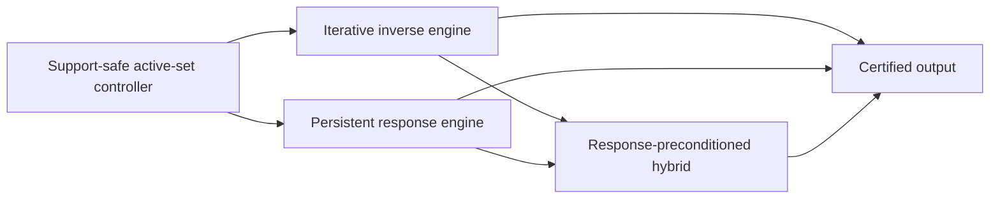

# Local Solver Family Roadmap

**Status:** Working research organization, not an accepted complexity theorem.

## Confidence statement

The project's current best risk-adjusted architecture combines persistent
response information with local iterative repair. This is a research judgment,
not a claim that every optimal local solver must be hybrid.

Two endpoints remain possible:

- a graph-uniform, output-sensitive incremental SDD/Schur solver could make the
  iterative layer unnecessary and improve the target all the way toward the
  explicit-output scale;
- a future expanding-subspace first-order method could attain the product scale
  without maintaining a nontrivial response representation.

The mixed architecture is valuable because it interpolates between these open
endpoints. It also gives a common place to reuse the project's proved support
gates, response identities, iterative convergence results, and counterexamples.

## Three independent axes

Do not identify the following choices.

| Axis | Alternatives | What it controls |
| --- | --- | --- |
| Graph access | Adjacency-list queries, supplied subgraph, global matrix access | Which graph information is available and charged. |
| Support evolution | Fixed, nested, or nonnested | Which principal systems occur and whether monotonicity or downdates are available. |
| Inverse realization | Iterative recurrence, persistent response, or a mixture | How the restricted inverse is represented and where condition-number dependence enters. |

In particular, a nested active set does not make an algorithm an SDD method.
ASPR, expanding-subspace FISTA, and restarted restricted CG use nested sets but
remain iterative unless they maintain an elimination, Schur, or comparable
graph-aware inverse representation.

## Common operator

The shared PageRank matrix is

\[
Q=\alpha I+\frac{1-\alpha}{2}\mathcal L,
\qquad
\alpha I\preceq Q\preceq I.
\]

For an active set \(S\), all solver families act on the same local Green
operator

\[
G_S:=Q_{SS}^{-1}.
\]

If \(S^+=S\cup T\), the new block is governed by

\[
K_T=Q_{TT}-Q_{TS}G_SQ_{ST}.
\]

The iterative family realizes \(G_S\) temporally through repeated row,
gradient, coordinate, splitting, or Krylov operations. The response family
realizes it spatially through elimination, factors, Schur complements, or
directed messages. A mixed method keeps a response for a settled anchor and
iterates on a smaller unresolved frontier.

## Backend-neutral controller

The active-set controller should depend on a small conceptual interface:

1. `Expand(T)`: incorporate a support-safe batch without materializing every
   old coordinate.
2. `BoundaryBounds()`: return certified intervals for boundary KKT demands or
   residues.
3. `Repair(tolerance)`: reduce numerical error on the current face.
4. `Finalize()`: materialize the terminal vector and its certificate once.

The interface is mathematical rather than an adopted implementation or
stopping-rule convention. Exact residual formulas remain note-scoped while
`docs/decisions/residual-convention.md` is open.

## Family map



The exhaustive per-note classification is machine-readable in
[`../manuscript/notes/taxonomy.toml`](../manuscript/notes/taxonomy.toml). Run

```bash
make note-report
```

to print its current Markdown table, or

```bash
make note-audit
```

to check it against the note manifest, note directories, build list, and
dependency graph.

## Complexity template

Let \(V\) denote the final charged active volume and let \(P_S\) be the
backend's current SPD preconditioner. Define

\[
\kappa_{\mathrm{eff}}(S)
=
\kappa\!\left(P_S^{-1/2}Q_{SS}P_S^{-1/2}\right).
\]

A useful conditional target is

\[
\widetilde O\!\left(
U_{\mathrm{response}}(V)
+V\sqrt{\sup_S\kappa_{\mathrm{eff}}(S)}
+V
\right),
\]

where \(U_{\mathrm{response}}\) includes all factor updates, adjacency
exposure, boundary reporting, rekeys, interval refinements, and state writes.
This expression is a proof template, not an established general theorem.

- With no graph-aware preconditioner, the spectral term is naturally
  \(\widetilde O(V/\sqrt\alpha)\).
- With a constant-quality response preconditioner but quadratic response
  maintenance, the repeated-prefix obstruction remains.
- With constant or polylogarithmic effective conditioning and
  \(U_{\mathrm{response}}(V)=\widetilde O(V)\), the target approaches
  \(\widetilde O(V)\).

## Current note routing

### Iterative track

Use this track for methods whose strongest graph-dependent primitive is a
local recurrence or restricted first-order/Krylov solve:

- `aesp_cd_l1_rppr`;
- `aesp_locgd_star_lower_bound`;
- `aspr23_bound_audit`;
- `hybrid_aesp_locsor`;
- `volume_gated_acceleration`;
- `evolving_support_cg`;
- `rlsor_terminal_exact_rung`;
- `frontier_adaptive_ladder`;
- `two_rung_sor`.

The phrase "exact rung" in the empirical SOR notes refers to unit coordinate
settlement. It is not by itself an exact restricted block solve.

### Response track

Use this track when persistent elimination or response state is the principal
algorithmic resource:

- `incremental_active_set_sdd`;
- the path, tree, bounded-block, shell, and quotient response solvers inside
  `delayed_reflection_ladder` and `propagate_settle_framework`.

For bounded biconnected blocks, ordinary adjacency access is now sufficient:
zero-prefix invariance at activation events permits online block mergers and
future-only response rebuilds.  Stable block identifiers are no longer an
assumption for the product-scale theorem.

### Mixed track

Use this track when propagation or acceleration and response settlement are
both essential:

- `adaptive_revisit_control`;
- `two_rung_direct_theory` after its Schur-deflation extension;
- `delayed_reflection_ladder`;
- `propagate_settle_framework`;
- `response_preconditioned_hybrid`.

### Model and synthesis track

Use this track for scope control, lower-bound models, and cross-note ledgers:

- `local_solver_oracle_hierarchy`;
- `hybrid_local_solver_complete_note`;
- `hybrid_local_solver_synthesis`.

## Priority proof obligations

### P0: finite-band response on general cyclic cores

Maintain enough of the boundary response to decide all demands outside a
prescribed normalized KKT band. Charge every old-face read, factor update,
rekey, ambiguity refinement, and reported activation. Exact zero-sign
maintenance is not required for approximate output.

This is the weakest known response theorem that plugs into the proved
finite-resolution continuation result in `propagate_settle_framework`.
The causal block-merge theorem closes this obligation for bounded blocks; the
P0 case is therefore a large nonequitable cyclic core, not block metadata
maintenance.

The finite-band interface is now margin-adaptive. Certified lower endpoints
drive safe admission, certified upper endpoints drive termination, and no
uniform pointwise estimate or coordinate-specific response leverage is
required. Exterior response changes are energy contractions, so degree volume
moving by a normalized margin is shock-packed. Source-aware squared leverage
is exactly terminal Schur-diagonal loss and telescopes to at most
`(1-alpha)/2` per still-exterior label. The remaining P0 primitive is dynamic
local maintenance of aggregate diagonal losses, yielding an output-sensitive
heavy-change reporter without refreshing the full boundary.

### P0: expanding-subspace acceleration without repeated restarts

Maintain a support-safe lower certificate separately from signed accelerated
variables. Extend the estimate sequence when the certified face grows, rather
than restarting a complete accelerated solve after each singleton expansion.

The fixed-envelope rate is already available in `aesp_cd_l1_rppr`; the
one-sided continuation obligation is isolated in
`volume_gated_acceleration`.

For the mixed response-preconditioned direction, the numerical accumulation
part is now closed: arbitrary approximate Schur-frontier corrections lift into
mutually `Q`-orthogonal subspaces, so their energy errors add in quadrature and
no old face is numerically restarted. The remaining mixed-track obligation is
to apply those lifts and report finite-band crossings within the charged
response budget. This does not solve the response-free estimate-sequence
problem above.

Static group-trace evaluation is also reduced to a logarithmic number of
source-normalized Gaussian response sketches: with high probability their
squared subtree sums give constant-factor masses for every hierarchy node
simultaneously. This static reduction does not by itself avoid dense exterior
updates or justify reusing one signed sketch along an adaptive trace.

The adaptive-sketch issue is now separated from that data-structural theorem.
At event j, draw fresh probes only after the new frontier space is fixed and
add their nonnegative squared masses with a summable conditional failure
budget. The normalized frontier spaces are mutually energy-orthogonal, and a
newly exposed boundary label has zero response to every older space. Thus all
prefix estimates remain valid without replay. What remains is the local
implementation of one signed normalized response followed by its squared-mass
range-add on the live hierarchy. Equivalently, the accumulated group mass is
the weighted decrease of the same terminal Schur diagonals from the initial to
the current face. A certified one-sided estimate may have additive error at
the current pruning scale, so the implementation need not estimate negligible
groups multiplicatively or retain the random source dimension.

The two available telescopes should be used together, not as separate update
clocks. For a still-exterior label or fixed hierarchy node, the response
uncertainty accumulated during an epoch is bounded by the square root of its
Schur-diagonal loss times the orthogonal correction energy spent in that
epoch. Disjoint wake-up epochs therefore obey a geometric-mean budget. For a
unit seed, a label `v` awakened at margin `Theta(alpha*tau)` is awakened only
`O(1/(tau*sqrt(alpha*d_v)))` times. The recommended scheduler is consequently
to let a hierarchy node sleep until the product of its accumulated loss and
energy reaches the current pruning scale. Publishing every additive
`alpha*tau` key change throws away this square-root gain. This is still a
per-label statement; an exposure-charged aggregate implementation is needed
before summing it into a graph-uniform work bound.

### P0: response-preconditioned composition

Keep a settled anchor \(A\), a frontier buffer \(F\), and the implicit block
response

\[
Q_{FF}-Q_{FA}Q_{AA}^{-1}Q_{AF}.
\]

Use geometric rebuilds for large frontier growth and low-rank or iterative
repair for small growth. Materialize the old-face correction only at final
output.

The dense reference backend now identifies a useful switching safeguard: give
every newly enlarged frontier one converged reduced-system probe before a
volume-triggered rebuild. A center-seeded star is a heavy batch but its Schur
frontier solves in one CG step, so immediate factor-two rebuilding is wasteful.
This is measured policy evidence, not an amortized local-work theorem.

The boundary-deflation theorem in `two_rung_direct_theory` now supplies one
exact structured preconditioner for this interface. Certified closed forest
decorations can be peeled in linear work; their lifted generalized eigenvalues
are exactly one, and the remaining effective condition number is precisely
that of the Schur 2-core. Thus acyclic decorations are no longer part of the
P0 conditioning problem. Online closure certification and finite-band
reporting on the remaining nonequitable cyclic core are still open. Absorbing
one closed component produces exactly one Green-column update and one
nonnegative exterior range-add vector, matching the response reporter's
current heavy-change primitive.

The newest response lemma gives a sharper reporter target. If a correction is
generated by a frontier batch `B`, its source-aware squared exterior
leverages sum to at most `|B|`. Thus the degree volume whose certified interval
can meet a prescribed transition margin is bounded before the dense correction
is materialized. A matched-edge example shows that a source-oblivious uniform
energy interval can still refresh the entire boundary after a one-row change.
A rank-sensitive branch-and-bound lemma further proves that constant-factor
subtree leverage-mass queries locate all candidate rows with probe count
controlled by the packed batch-rank/energy budget and hierarchy depth. The P0
data structure can therefore be stated as a dynamic aggregate
Schur-diagonal-loss oracle with scale-matched additive error, equivalently a
source-conditioned group-trace oracle; uniform global error clocks are not
sufficient.

There is a close external blueprint: the dynamic electrical-flow locator of
[van den Brand et al.](https://arxiv.org/abs/2112.00722) combines dynamic
spectral vertex sparsifiers with an $\ell_2$ heavy-hitter recovery map to find
large-energy coordinates. This supports the proposed architecture, but does
not supply the theorem here: its preprocessing and update bounds are measured
against the ambient graph and its resistance-update sequence. A valid import
must instead handle monotone terminal additions, vertex boundary demands,
adaptive finite-band intervals, and charge every sketch/Schur operation to the
locally exposed volume.

The import is algebraically exact after diagonal scaling: the PageRank
Stieltjes matrix is congruent to the grounded Laplacian with conductance
`(1-alpha)/2` on original edges and `alpha*d_v` from each vertex to ground.
Moreover, the response operator for a face depends only on its internal edges,
cut incidences, and boundary degrees; edges wholly in the unexposed exterior
are irrelevant. Static locator input is therefore exposure-sized, and
geometric rebuilding can already be charged to final active volume. The next
construction attempt should specialize that locator rather than invent a
response hierarchy from scratch: maintain exposed-terminal Schur state within
each epoch, recover degree-scaled vertex-response heavy hitters, wake nodes by
the loss--energy product, and exactly test only the finite-band candidates.
The proof must account separately for terminal additions, epoch-internal
locator refreshes, candidate tests, and rebuilds.

The exact interface between the iterative frontier and this locator is now
available. At a fixed anchor, precompute transposed harmonic extensions for
the rows of any chosen linear boundary sketch. Once the iterative arm solves
the Schur-frontier system, the full exterior dual-update sketch is obtained
from scans of the frontier incidences and reads of the touched stored sketch
rows; the known frontier source is subtracted. The dense old-face correction
and the ambient boundary are never materialized. CountSketch or hierarchical
measurements are therefore legitimate concrete candidates, but their row
count, anchor right-hand-side solves, stored-response reads, and dynamic
maintenance must all fit the exposure ledger.

### P1: lower-bound separation by computational resource

Use adjacency access as the ambient input model, then state the additional
linear-span, materialization, recurrence, or response restrictions needed by a
lower bound. Do not promote an algorithm-specific star, path, or spider bound
to all adjacency-access algorithms.

The desired separation is an instance family that requires the product scale
for a precisely defined local-linear-span class but admits output-sensitive
persistent response.

## Experimental program

All backends should eventually run behind one controller and emit the same
work ledger:

- newly exposed adjacency volume;
- repeated old-face reads;
- propagation row operations;
- response or factor updates;
- boundary queries and rekeys;
- numerical repair work;
- final output writes;
- peak and cumulative active volume.

The initial graph suite should contain endpoint paths, center-seeded stars,
long spiders, tailed fans, high-degree decoys, trees with asymmetric branches,
cycles, equitable thick-shell graphs, bounded-block compositions, and
nonequitable cyclic cores. Every run must retain its note-scoped accuracy name
until the repository residual decision is resolved.

## Stop/go criteria

Continue the mixed route if at least one of the following is established:

- a finite-band response oracle with total product-scale work;
- a response preconditioner with bounded effective condition and amortized
  local application cost;
- an expanding-subspace acceleration lemma that survives certified support
  additions;
- a graph family on which the mixed method provably separates from both
  endpoint implementations.

Narrow or abandon a proposed universal mixed theorem if its proof requires an
uncharged boundary scan, future-support advice, an unproved conversion between
accuracy namespaces, or explicit materialization of every old coordinate after
every expansion.
