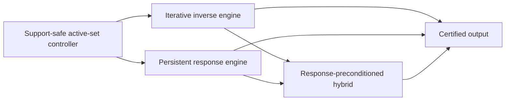

# Local Solver Family Roadmap

**Status:** Working research organization, not an accepted complexity theorem.

## Confidence statement

The project's current best risk-adjusted architecture combines persistent
response information with local iterative repair. This is a research judgment,
not a claim that every optimal local solver must be hybrid.

Two endpoints remain possible:

- a graph-uniform, output-sensitive incremental SDD/Schur solver could make the
  iterative layer unnecessary and improve the target all the way toward the
  explicit-output scale;
- a future expanding-subspace first-order method could attain the product scale
  without maintaining a nontrivial response representation.

The mixed architecture is valuable because it interpolates between these open
endpoints. It also gives a common place to reuse the project's proved support
gates, response identities, iterative convergence results, and counterexamples.

## Three independent axes

Do not identify the following choices.

| Axis | Alternatives | What it controls |
| --- | --- | --- |
| Graph access | Adjacency-list queries, supplied subgraph, global matrix access | Which graph information is available and charged. |
| Support evolution | Fixed, nested, or nonnested | Which principal systems occur and whether monotonicity or downdates are available. |
| Inverse realization | Iterative recurrence, persistent response, or a mixture | How the restricted inverse is represented and where condition-number dependence enters. |

In particular, a nested active set does not make an algorithm an SDD method.
ASPR, expanding-subspace FISTA, and restarted restricted CG use nested sets but
remain iterative unless they maintain an elimination, Schur, or comparable
graph-aware inverse representation.

## Common operator

The shared PageRank matrix is

\[
Q=\alpha I+\frac{1-\alpha}{2}\mathcal L,
\qquad
\alpha I\preceq Q\preceq I.
\]

For an active set \(S\), all solver families act on the same local Green
operator

\[
G_S:=Q_{SS}^{-1}.
\]

If \(S^+=S\cup T\), the new block is governed by

\[
K_T=Q_{TT}-Q_{TS}G_SQ_{ST}.
\]

The iterative family realizes \(G_S\) temporally through repeated row,
gradient, coordinate, splitting, or Krylov operations. The response family
realizes it spatially through elimination, factors, Schur complements, or
directed messages. A mixed method keeps a response for a settled anchor and
iterates on a smaller unresolved frontier.

## Backend-neutral controller

The active-set controller should depend on a small conceptual interface:

1. `Expand(T)`: incorporate a support-safe batch without materializing every
   old coordinate.
2. `BoundaryBounds()`: return certified intervals for boundary KKT demands or
   residues.
3. `Repair(tolerance)`: reduce numerical error on the current face.
4. `Finalize()`: materialize the terminal vector and its certificate once.

The interface is mathematical rather than an adopted implementation or
stopping-rule convention. Exact residual formulas remain note-scoped while
`docs/decisions/residual-convention.md` is open.

## Family map



The exhaustive per-note classification is machine-readable in
[`../manuscript/notes/taxonomy.toml`](../manuscript/notes/taxonomy.toml). Run

```bash
make note-report
```

to print its current Markdown table, or

```bash
make note-audit
```

to check it against the note manifest, note directories, build list, and
dependency graph.

## Complexity template

Let \(V\) denote the final charged active volume and let \(P_S\) be the
backend's current SPD preconditioner. Define

\[
\kappa_{\mathrm{eff}}(S)
=
\kappa\!\left(P_S^{-1/2}Q_{SS}P_S^{-1/2}\right).
\]

A useful conditional target is

\[
\widetilde O\!\left(
U_{\mathrm{response}}(V)
+V\sqrt{\sup_S\kappa_{\mathrm{eff}}(S)}
+V
\right),
\]

where \(U_{\mathrm{response}}\) includes all factor updates, adjacency
exposure, boundary reporting, rekeys, interval refinements, and state writes.
This expression is a proof template, not an established general theorem.

- With no graph-aware preconditioner, the spectral term is naturally
  \(\widetilde O(V/\sqrt\alpha)\).
- With a constant-quality response preconditioner but quadratic response
  maintenance, the repeated-prefix obstruction remains.
- With constant or polylogarithmic effective conditioning and
  \(U_{\mathrm{response}}(V)=\widetilde O(V)\), the target approaches
  \(\widetilde O(V)\).

## Current note routing

### Iterative track

Use this track for methods whose strongest graph-dependent primitive is a
local recurrence or restricted first-order/Krylov solve:

- `aesp_cd_l1_rppr`;
- `aesp_locgd_star_lower_bound`;
- `aspr23_bound_audit`;
- `hybrid_aesp_locsor`;
- `volume_gated_acceleration`;
- `evolving_support_cg`;
- `rlsor_terminal_exact_rung`;
- `frontier_adaptive_ladder`;
- `two_rung_sor`.

The phrase "exact rung" in the empirical SOR notes refers to unit coordinate
settlement. It is not by itself an exact restricted block solve.

### Response track

Use this track when persistent elimination or response state is the principal
algorithmic resource:

- `incremental_active_set_sdd`;
- the path, tree, bounded-block, shell, and quotient response solvers inside
  `delayed_reflection_ladder` and `propagate_settle_framework`.

### Mixed track

Use this track when propagation or acceleration and response settlement are
both essential:

- `adaptive_revisit_control`;
- `two_rung_direct_theory` after its Schur-deflation extension;
- `delayed_reflection_ladder`;
- `propagate_settle_framework`;
- `response_preconditioned_hybrid`.

### Model and synthesis track

Use this track for scope control, lower-bound models, and cross-note ledgers:

- `local_solver_oracle_hierarchy`;
- `hybrid_local_solver_complete_note`;
- `hybrid_local_solver_synthesis`.

## Priority proof obligations

### P0: finite-band response on general cyclic cores

Maintain enough of the boundary response to decide all demands outside a
prescribed normalized KKT band. Charge every old-face read, factor update,
rekey, ambiguity refinement, and reported activation. Exact zero-sign
maintenance is not required for approximate output.

This is the weakest known response theorem that plugs into the proved
finite-resolution continuation result in `propagate_settle_framework`.

### P0: expanding-subspace acceleration without repeated restarts

Maintain a support-safe lower certificate separately from signed accelerated
variables. Extend the estimate sequence when the certified face grows, rather
than restarting a complete accelerated solve after each singleton expansion.

The fixed-envelope rate is already available in `aesp_cd_l1_rppr`; the
one-sided continuation obligation is isolated in
`volume_gated_acceleration`.

### P0: response-preconditioned composition

Keep a settled anchor \(A\), a frontier buffer \(F\), and the implicit block
response

\[
Q_{FF}-Q_{FA}Q_{AA}^{-1}Q_{AF}.
\]

Use geometric rebuilds for large frontier growth and low-rank or iterative
repair for small growth. Materialize the old-face correction only at final
output.

### P1: lower-bound separation by computational resource

Use adjacency access as the ambient input model, then state the additional
linear-span, materialization, recurrence, or response restrictions needed by a
lower bound. Do not promote an algorithm-specific star, path, or spider bound
to all adjacency-access algorithms.

The desired separation is an instance family that requires the product scale
for a precisely defined local-linear-span class but admits output-sensitive
persistent response.

## Experimental program

All backends should eventually run behind one controller and emit the same
work ledger:

- newly exposed adjacency volume;
- repeated old-face reads;
- propagation row operations;
- response or factor updates;
- boundary queries and rekeys;
- numerical repair work;
- final output writes;
- peak and cumulative active volume.

The initial graph suite should contain endpoint paths, center-seeded stars,
long spiders, tailed fans, high-degree decoys, trees with asymmetric branches,
cycles, equitable thick-shell graphs, bounded-block compositions, and
nonequitable cyclic cores. Every run must retain its note-scoped accuracy name
until the repository residual decision is resolved.

## Stop/go criteria

Continue the mixed route if at least one of the following is established:

- a finite-band response oracle with total product-scale work;
- a response preconditioner with bounded effective condition and amortized
  local application cost;
- an expanding-subspace acceleration lemma that survives certified support
  additions;
- a graph family on which the mixed method provably separates from both
  endpoint implementations.

Narrow or abandon a proposed universal mixed theorem if its proof requires an
uncharged boundary scan, future-support advice, an unproved conversion between
accuracy namespaces, or explicit materialization of every old coordinate after
every expansion.
